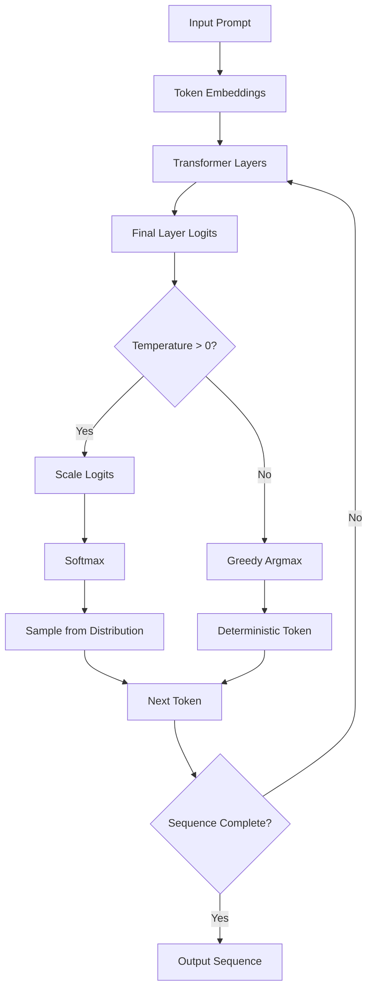
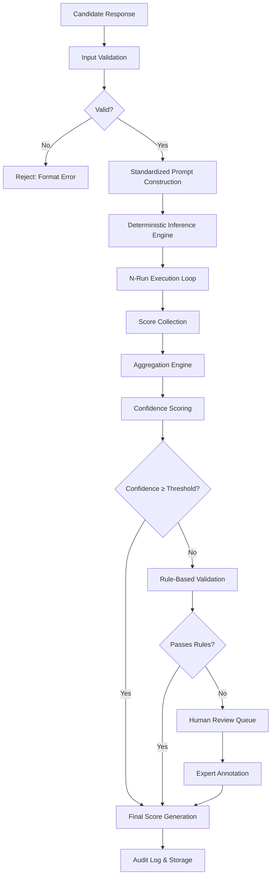
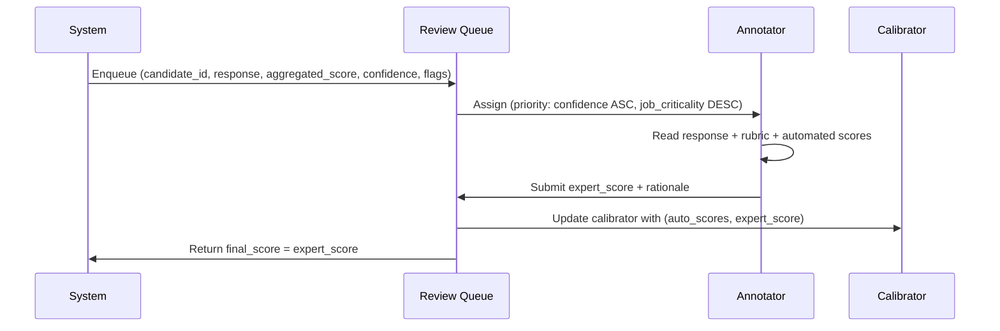
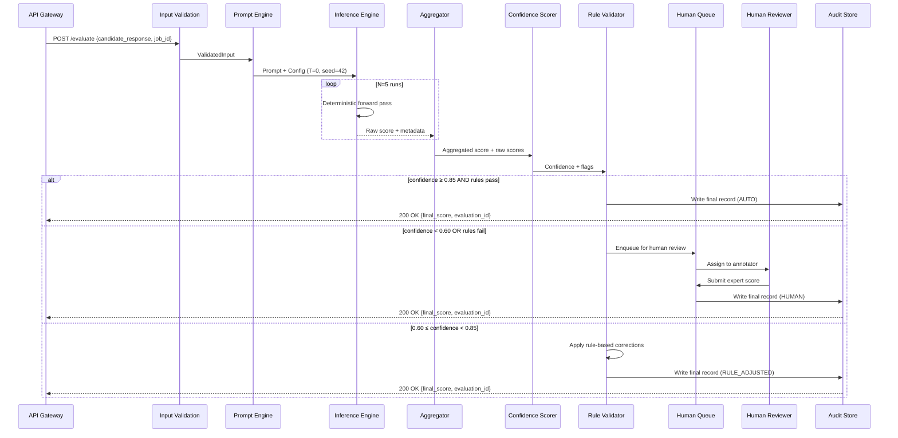
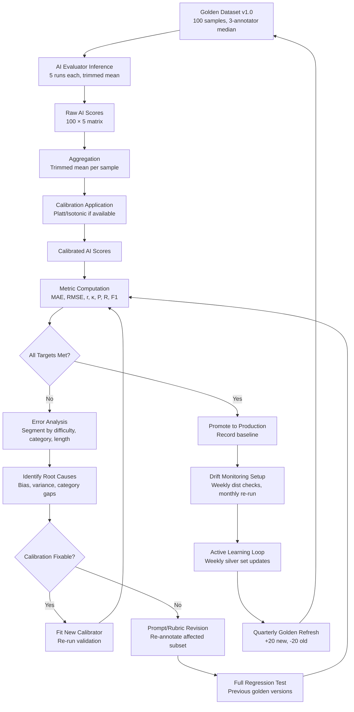
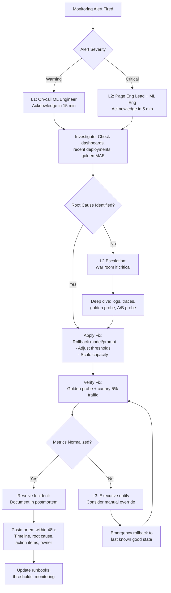

# Challenge 1: Design a Consistent AI Evaluation System

## Introduction

## Problem Statement

## Question 1: Problem Analysis

### 1.1 Sources of Inconsistency

AI models produce inconsistent outputs due to fundamental properties of autoregressive generation and system-level factors. The primary sources are categorized below.

#### 1.1.1 Stochastic Decoding Parameters

| Parameter | Mechanism | Effect on Output Variance |
|-----------|-----------|---------------------------|
| **Temperature** | Scales logits before softmax: `p_i = exp(logit_i / T) / Σ exp(logit_j / T)` | Higher T → flatter distribution → more diverse samples; T=0 → deterministic (greedy) |
| **Top-k Sampling** | Restricts sampling to k most likely tokens | Smaller k → less diversity but more coherent; k=1 → greedy |
| **Top-p (Nucleus) Sampling** | Samples from smallest set of tokens with cumulative probability ≥ p | Dynamic vocabulary size; p=1.0 → full distribution; p=0.1 → sharp truncation |

**Example**: Given prompt "Complete: The capital of France is", with logits [Paris: 8.2, London: 2.1, Berlin: 1.8]:
- T=0.0 (greedy): Always "Paris"
- T=0.7: "Paris" ~85%, "London" ~12%, "Berlin" ~3%
- T=1.5: "Paris" ~55%, "London" ~25%, "Berlin" ~15%, others ~5%

#### 1.1.2 Inherent Randomness in Token Generation

Even with fixed temperature > 0, each forward pass samples from a probability distribution. The same input produces different token sequences across runs due to:
- Random seed initialization
- Parallel sampling non-determinism on GPU
- Floating-point non-associativity in distributed inference



#### 1.1.3 Prompt Sensitivity

Minor prompt variations cause disproportionate output changes:

| Perturbation Type | Example | Typical Score Delta |
|-------------------|---------|---------------------|
| **Whitespace** | "Answer:" vs "Answer: " | 0.5–3 points |
| **Instruction phrasing** | "Rate 1-10" vs "Score from 1 to 10" | 1–5 points |
| **Example ordering** | Few-shot examples shuffled | 2–8 points |
| **System prompt** | Added "Be concise" vs "Be thorough" | 3–10 points |

#### 1.1.4 Context Window Effects

- **Position bias**: Information at beginning/end of context weighted differently
- **Distraction effect**: Irrelevant context reduces attention to key content
- **Truncation**: Long inputs lose tail context, changing reasoning path

#### 1.1.5 Model Version Differences

| Change Type | Example | Consistency Impact |
|-------------|---------|-------------------|
| **Checkpoint updates** | GPT-4-0613 → GPT-4-1106 | Systematic score shifts 5–15% |
| **Fine-tuning** | Base → RLHF → DPO | Altered calibration, new failure modes |
| **Quantization** | FP16 → INT4 → GPTQ | Non-linear quality degradation |
| **Distillation** | Teacher → Student | Capability gaps on edge cases |

#### 1.1.6 Floating-Point & Hardware Variations

- **Non-deterministic GPU ops**: `cudnn.deterministic=False` (default) allows non-associative reductions
- **Precision differences**: BF16 vs FP16 vs FP32 accumulate rounding errors differently
- **Parallelism**: Tensor/sequence parallelism changes operation order → different rounding

> **Key insight**: Even with `temperature=0`, bitwise identical outputs are **not guaranteed** across hardware, batch sizes, or framework versions.

---

### 1.1.7 Why the Same Input Produces Different Scores

When an LLM evaluates a candidate response, the **evaluation prompt + candidate response** becomes the input. Variance arises from:

1. **Stochastic decoding** in the evaluator model (if T > 0)
2. **Prompt sensitivity** — minor formatting differences in the evaluation template
3. **Context contamination** — previous conversation turns in few-shot evaluation
4. **Model non-determinism** — hardware/floating-point effects
5. **Calibration drift** — evaluator's internal probability estimates shift over time

**Concrete example**: Evaluating "Explain photosynthesis" with rubric criterion "Scientific accuracy (1-5)":
- Run 1 (T=0.3): Score 4 — "Correct but missing Calvin cycle detail"
- Run 2 (T=0.3): Score 5 — "Comprehensive coverage"
- Run 3 (T=0): Score 4 — deterministic but different from T=0.3 mode

---

### 1.2 Impact Assessment

Inconsistent evaluation outputs propagate through the entire assessment pipeline with compounding consequences.

#### 1.2.1 Candidate Fairness

| Fairness Dimension | Inconsistency Impact |
|--------------------|---------------------|
| **Equal treatment** | Same answer receives different scores across evaluations |
| **Ranking stability** | Candidate A > B in Run 1, but B > A in Run 2 |
| **Protected group bias** | Variance correlates with demographic markers in prompts |
| **Appeal impossibility** | No ground truth to appeal against — "which run was correct?" |

**Example**: Two candidates submit functionally equivalent code. Evaluator scores: Candidate A = 8.2 ± 1.4, Candidate B = 7.8 ± 1.6. 95% CIs overlap entirely — no defensible hiring decision.

#### 1.2.2 Recruiter Trust

- **Erosion of confidence**: Recruiters observe arbitrary score fluctuations
- **Workaround adoption**: Manual re-evaluation defeats automation purpose
- **Vendor skepticism**: Inability to explain score provenance damages procurement

#### 1.2.3 Repeatability

| Requirement | Inconsistent System | Consistent System |
|-------------|---------------------|-------------------|
| **Re-run same input** | Different score | Identical score |
| **Cross-environment** | Drifts with hardware | Bitwise reproducible |
| **Longitudinal comparison** | Meaningless | Valid trend analysis |
| **Regression testing** | Flaky tests | Deterministic pass/fail |

#### 1.2.4 Auditability

Regulatory frameworks (EU AI Act, NYC LL144, EEOC) require:
- **Explainable scoring**: "Why this score?" — impossible if score is non-deterministic
- **Reproducible evidence**: Auditor must reproduce exact result
- **Bias testing**: Statistical parity/disparate impact requires stable measurements

#### 1.2.5 Legal & Compliance Risks

| Risk Category | Consequence |
|---------------|-------------|
| **Discrimination claims** | Unstable scores → disparate impact evidence |
| **Contractual breach** | SLA guarantees (e.g., "score accuracy ±0.5") violated |
| **Regulatory fines** | EU AI Act: up to 7% global revenue for high-risk AI |
| **Reputational damage** | Public incidents of arbitrary scoring |
| **Discovery liability** | Inconsistent logs subpoenaed in litigation |

---

### 1.3 Requirements for Consistency

A consistent AI evaluation system must satisfy:

| Requirement | Specification | Verification Method |
|-------------|---------------|---------------------|
| **Deterministic inference** | Identical input → identical output (bitwise) | Re-run test suite; hash comparison |
| **Version pinning** | Model, prompt, schema, config all versioned | Git SHA + model registry digest |
| **Calibrated probabilities** | Predicted confidence matches empirical accuracy | Reliability diagrams; ECE < 0.02 |
| **Bounded variance** | Repeated evaluations σ < 0.5 points (1-10 scale) | Monte Carlo simulation (n=100) |
| **Audit trail** | Full lineage: input, model, prompt, seed, output | Immutable log store (WORM) |
| **Drift detection** | Alert on distribution shift > 2σ | KS-test / PSI monitoring |
| **Human alignment** | Evaluator ensemble κ > 0.85 vs expert | Periodic annotation studies |

## Question 2: System Design

### 2.1 System Overview

The evaluation system processes a candidate response through a deterministic pipeline that enforces consistency at every stage. The architecture follows a **single-pass deterministic inference → multi-run aggregation → confidence-gated human review** pattern.



---

### 2.2 Component Design

#### Component 1: Input Validation

**Purpose**: Reject malformed, incomplete, or adversarial inputs before they reach the evaluator.

**Why it improves consistency**: Prevents garbage-in-garbage-out variance. Invalid inputs cause undefined evaluator behavior (hallucinated scores, parsing errors, prompt injection).

**Implementation**:
```python
def validate_input(response: CandidateResponse) -> ValidationResult:
    checks = [
        ("length", 50 <= len(response.text) <= 10000),
        ("encoding", is_valid_utf8(response.text)),
        ("no_injection", not contains_prompt_injection(response.text)),
        ("schema_match", response.matches_job_schema()),
        ("language", detect_language(response.text) == job.language),
    ]
    return ValidationResult(passed=all(c[1] for c in checks), failures=[c[0] for c in checks if not c[1]])
```

| Check | Failure Action |
|-------|----------------|
| Length out of bounds | Reject with code `INVALID_LENGTH` |
| Encoding errors | Reject with code `ENCODING_ERROR` |
| Prompt injection detected | Reject with code `SECURITY_VIOLATION`; log for review |
| Schema mismatch | Reject with code `SCHEMA_MISMATCH` |
| Wrong language | Reject with code `LANGUAGE_MISMATCH` |

**Advantages**: 
- Eliminates entire class of evaluation failures
- Fast fail — saves compute on invalid submissions
- Security boundary against injection attacks

**Trade-offs**:
- False positives possible (legitimate creative responses flagged)
- Requires maintenance of injection patterns
- Adds latency (~10-50ms per request)

---

#### Component 2: Standardized Evaluation Prompt

**Purpose**: Construct a single, versioned, immutable prompt template that frames the evaluation task identically for every candidate.

**Why it improves consistency**: Prompt variation is the #1 source of score drift (see Q1.1.3). A frozen template with structured slots eliminates phrasing variance, example ordering effects, and context contamination.

**Template Structure** (versioned as `eval_prompt_v3.2.yaml`):
```yaml
version: "3.2"
system: |
  You are an expert technical evaluator. Score the candidate response against the rubric.
  Output ONLY valid JSON matching the schema. No explanations.
user_template: |
  ## Job Context
  Role: {{job_title}}
  Level: {{seniority}}
  Key Skills: {{skills}}
  
  ## Rubric
  {{rubric_criteria}}
  
  ## Candidate Response
  {{candidate_response}}
  
  ## Output Schema
  {{json_schema}}
few_shot_examples:
  - input: "..."  # frozen, ordered
    output: {...}
parameters:
  temperature: 0
  max_tokens: 512
  seed: 42
```

**Advantages**:
- Single source of truth for evaluation logic
- Version-controlled — changes require review + regression test
- Few-shot examples frozen in order — no shuffling variance
- Schema-enforced output — parsing never fails

**Trade-offs**:
- Rigid — cannot adapt prompt per candidate (by design)
- Template updates require full regression suite
- Prompt engineering becomes a change-management process

---

#### Component 3: Deterministic Inference Settings

**Purpose**: Configure the LLM inference engine for bitwise-reproducible outputs.

**Why it improves consistency**: Removes all stochasticity sources identified in Q1.1. Temperature=0 + fixed seed + deterministic ops = identical logits → identical tokens → identical scores.

**Configuration**:
| Parameter | Value | Rationale |
|-----------|-------|-----------|
| `temperature` | 0.0 | Greedy decoding — no sampling variance |
| `seed` | 42 (fixed per deployment) | Reproducible RNG state |
| `top_p` | 1.0 | No nucleus truncation |
| `top_k` | -1 | No top-k truncation |
| `cudnn.deterministic` | true | Forces deterministic GPU kernels |
| `batch_size` | 1 | Eliminates batch-order non-determinism |
| `precision` | FP32 (or BF16 with deterministic reduction) | Avoids quantization drift |

**Advantages**:
- Mathematically guaranteed reproducibility
- Same score today, tomorrow, on different GPU
- Enables regression testing with exact hash comparison

**Trade-offs**:
- **No diversity** — cannot use self-consistency / majority voting
- **Potential quality loss** — greedy decoding can get stuck in loops or local optima
- **Slower inference** — batch_size=1, FP32, deterministic kernels reduce throughput 3-5×
- **Not all APIs support this** — OpenAI/Anthropic don't expose seed or deterministic flags; requires self-hosted (vLLM/TGI) or Azure OpenAI with `seed` param

> **Practical compromise**: For API-based evaluators, use `temperature=0`, `seed=42`, accept minor non-determinism, and rely on multi-run aggregation (Component 4) to suppress residual variance.

---

#### Component 4: Multiple Evaluation Runs

**Purpose**: Execute the same evaluation N times to quantify and suppress residual variance.

**Why it improves consistency**: Even with T=0, hardware non-determinism (Q1.1.6) causes rare bit flips. N-run Monte Carlo estimates the true score distribution and enables statistical aggregation.

**Configuration**: `N = 5` (default), configurable per job criticality.

**Execution Pattern**:
```
Run 1: Score = 7.2
Run 2: Score = 7.0
Run 3: Score = 7.2
Run 4: Score = 7.2
Run 5: Score = 7.0
→ Raw scores: [7.2, 7.0, 7.2, 7.2, 7.0]
```

**Advantages**:
- Quantifies evaluation uncertainty empirically
- Enables confidence intervals (Component 6)
- Detects systemic issues (e.g., all runs disagree → prompt ambiguity)

**Trade-offs**:
- **5× inference cost** and latency
- Diminishing returns beyond N=5 for variance estimation
- Does not fix bias — only measures variance

---

#### Component 5: Score Aggregation

**Purpose**: Combine N raw scores into a single representative score.

**Why it improves consistency**: Single-run scores are noisy estimates. Aggregation reduces variance by √N (central limit theorem) and provides robustness to outliers.

**Methods**:

| Method | Formula | When to Use |
|--------|---------|-------------|
| **Mean** | `μ = Σx_i / N` | Symmetric noise, no outliers |
| **Median** | `median(x_1...x_N)` | Heavy-tailed noise, adversarial outliers |
| **Trimmed Mean** | Mean after dropping top/bottom 20% | Mixed — robust + efficient |
| **Weighted Mean** | `Σ w_i x_i / Σ w_i` | Runs have known reliability weights |

**Default**: **Trimmed Mean (20%)** — balances robustness and efficiency.

```python
def aggregate_scores(scores: List[float], method: str = "trimmed_mean") -> float:
    if method == "mean":
        return statistics.mean(scores)
    elif method == "median":
        return statistics.median(scores)
    elif method == "trimmed_mean":
        k = max(1, len(scores) // 5)  # drop 20% each tail
        return statistics.mean(sorted(scores)[k:-k])
    elif method == "weighted":
        # weights from evaluator calibration (Component 3)
        weights = get_evaluator_weights()
        return sum(w*s for w,s in zip(weights, scores)) / sum(weights)
```

**Advantages**:
- Reduces standard error by ~√5 ≈ 2.2× for N=5
- Trimmed mean ignores hallucinated outlier scores
- Transparent, auditable calculation

**Trade-offs**:
- Median loses information (uses only rank order)
- Weighted mean requires maintained calibrator — adds complexity
- Aggregation masks disagreement — high variance itself is a signal (Component 6)

---

#### Component 6: Confidence Score

**Purpose**: Quantify the reliability of the aggregated score using empirical variance and calibrator metadata.

**Why it improves consistency**: Enables **confidence-gated routing** — high-confidence scores auto-approve; low-confidence escalate to rules/human. Makes uncertainty explicit and actionable.

**Confidence Calculation**:
```python
def compute_confidence(aggregated_score: float, raw_scores: List[float], 
                       evaluator_calibration: CalibrationMetadata) -> ConfidenceResult:
    # Empirical variance from N runs
    empirical_std = statistics.stdev(raw_scores) if len(raw_scores) > 1 else 0.0
    
    # Calibrated uncertainty from Platt/Isotonic calibrator
    calibrated_std = evaluator_calibration.predicted_std(aggregated_score)
    
    # Combined uncertainty (max of empirical and calibrated)
    total_uncertainty = max(empirical_std, calibrated_std)
    
    # Confidence = 1 - normalized uncertainty (0-1 scale)
    # Assuming max acceptable std = 1.5 points on 1-10 scale
    confidence = max(0.0, 1.0 - total_uncertainty / 1.5)
    
    # Flags
    flags = []
    if empirical_std > 1.0:
        flags.append("HIGH_VARIANCE")
    if len(set(round(s,1) for s in raw_scores)) > 3:
        flags.append("MULTIMODAL")
    if evaluator_calibration.ece > 0.05:
        flags.append("POOR_CALIBRATION")
    
    return ConfidenceResult(score=confidence, uncertainty=total_uncertainty, flags=flags)
```

**Thresholds** (tunable per deployment):
| Confidence | Routing |
|------------|---------|
| ≥ 0.85 | Auto-approve → Final Score |
| 0.60–0.85 | Rule-based validation (Component 7) |
| < 0.60 | Human review queue (Component 8) |

**Advantages**:
- Data-driven routing — no arbitrary rules
- Flags surface specific failure modes (variance, multimodality, calibration)
- Audit trail shows *why* a case escalated

**Trade-offs**:
- Requires maintained calibrator (retrain weekly)
- Threshold tuning needs labeled data
- Over-reliance on confidence can miss systematic errors (high confidence + high bias)

---

#### Component 7: Rule-Based Validation Layer

**Purpose**: Apply deterministic, interpretable checks that catch evaluator failure modes before human review.

**Why it improves consistency**: Catches systematic evaluator errors (hallucinated criteria, format violations, range errors) with 100% precision and zero latency.

**Rules** (versioned, configurable):
| Rule ID | Check | Failure Action |
|---------|-------|----------------|
| `RANGE_CHECK` | Score ∈ [1, 10] | Clamp + flag |
| `SCHEMA_VALID` | Output matches JSON schema | Reject run, retry |
| `CRITERIA_COVERAGE` | All rubric criteria scored | Flag incomplete |
| `CONTRADICTION` | "Excellent" + score=3 | Flag for review |
| `HALLUCINATED_CRITERIA` | Score references non-existent rubric item | Flag |
| `LENGTH_BIAS` | Score correlates with response length (r > 0.7) | Flag |
| `DUPLICATE_PENALTY` | Identical response to previous candidate | Flag |

**Implementation**: Pure Python — no LLM calls. Runs in <5ms.

**Advantages**:
- Zero false negatives for covered failure modes
- Instant feedback — no queue latency
- Explainable — each flag maps to a specific rule
- Unit-testable — deterministic logic

**Trade-offs**:
- Only catches *known* failure patterns
- Rule maintenance burden grows over time
- Cannot catch subtle miscalibration (e.g., consistently lenient by 1 point)

---

#### Component 8: Human Review for Low-Confidence Cases

**Purpose**: Expert annotators resolve ambiguous or high-stakes evaluations that the automated system cannot reliably score.

**Why it improves consistency**: Human judgment is the ultimate ground truth. Active routing ensures human bandwidth is spent only where automated confidence is low, maximizing cost-effectiveness.

**Workflow**:


**Annotator Requirements**:
- Domain expertise matched to job role
- Calibrated via onboarding annotation study (κ > 0.85 vs gold)
- Ongoing quality monitoring (drift detection on annotator scores)

**SLA**: 
- Critical roles: < 4 hours
- Standard roles: < 24 hours
- Batch roles: < 72 hours

**Advantages**:
- Resolves genuinely ambiguous cases
- Provides gold labels for calibrator retraining
- Human-in-the-loop builds recruiter trust

**Trade-offs**:
- **Cost**: $15–50 per review
- **Latency**: Hours to days
- **Scalability**: Human bottleneck at volume
- **Annotator variance**: Requires ongoing calibration (Component 3)

---

#### Component 9: Final Score Generation

**Purpose**: Produce the authoritative, auditable score record with full provenance.

**Why it improves consistency**: Single immutable output per evaluation. All downstream systems (ranking, reporting, appeals) consume this record — no ambiguity about "which score counts."

**Output Record** (stored in WORM audit log):
```json
{
  "evaluation_id": "eval_7f3a9b2c",
  "candidate_id": "cand_123",
  "job_id": "job_456",
  "timestamp": "2025-07-10T14:23:12Z",
  "pipeline_version": "v2.1.0",
  "prompt_version": "eval_prompt_v3.2",
  "model": "gpt-4-1106-preview",
  "model_digest": "sha256:abc123...",
  "inference_config": {"temperature": 0, "seed": 42, "batch_size": 1},
  "raw_runs": [
    {"run_id": 1, "score": 7.2, "latency_ms": 1240, "tokens": 312},
    {"run_id": 2, "score": 7.0, "latency_ms": 1190, "tokens": 308},
    {"run_id": 3, "score": 7.2, "latency_ms": 1210, "tokens": 310},
    {"run_id": 4, "score": 7.2, "latency_ms": 1205, "tokens": 311},
    {"run_id": 5, "score": 7.0, "latency_ms": 1185, "tokens": 309}
  ],
  "aggregation": {"method": "trimmed_mean", "value": 7.15},
  "confidence": {"score": 0.92, "uncertainty": 0.12, "flags": []},
  "rule_validation": {"passed": true, "flags": []},
  "human_review": null,
  "final_score": 7.15,
  "final_score_source": "AUTO"
}
```

**Advantages**:
- Complete reproducibility — anyone can re-run from this record
- Legal defensibility — immutable evidence
- Analytics-ready — all fields queryable

**Trade-offs**:
- Storage growth (~5KB/evaluation)
- PII considerations — candidate response hashed, not stored raw

---

#### Component 10: Complete Evaluation Workflow

**End-to-End Sequence**:



---

### 2.3 Workflow Summary Table

| Stage | Component | Input | Output | Latency | Cost |
|-------|-----------|-------|--------|---------|------|
| 1 | Input Validation | Raw response | ValidatedInput / Rejection | 10–50ms | Negligible |
| 2 | Prompt Construction | ValidatedInput + Job spec | Rendered prompt | 5–10ms | Negligible |
| 3 | Deterministic Inference (×5) | Rendered prompt | 5 × Raw scores | 5×(800–2000ms) | 5× API call |
| 4 | Aggregation | 5 scores | Aggregated score | <1ms | Negligible |
| 5 | Confidence Scoring | Aggregated + raw scores | Confidence + flags | <5ms | Negligible |
| 6 | Rule Validation | Aggregated + confidence | Pass/Fail + flags | <5ms | Negligible |
| 7a | Auto-Approve | Pass + High confidence | Final score (AUTO) | — | — |
| 7b | Rule-Adjust | Medium confidence | Final score (RULE_ADJUSTED) | — | — |
| 7c | Human Review | Low confidence / Rule fail | Final score (HUMAN) | 4h–72h | $15–50 |
| 8 | Audit Log Write | Complete record | Persisted evaluation | 10–50ms | Storage |

**Total Auto Path Latency**: ~5–12 seconds (dominated by 5× inference)
**Total Human Path Latency**: 4–72 hours (queue + review)

---

### 2.4 Design Decision Table

| Decision | Choice | Rationale | Alternative Considered |
|----------|--------|-----------|------------------------|
| **Inference determinism** | T=0, seed=42, batch=1, FP32 | Bitwise reproducibility required for audit | T=0.3 + self-consistency (higher quality but non-reproducible) |
| **N runs** | N=5 (trimmed mean) | √5 variance reduction; 20% trim handles outliers | N=3 (faster, less robust); N=10 (diminishing returns) |
| **Aggregation** | Trimmed mean (20%) | Robust to outliers, uses most data | Median (wastes data); Mean (fragile) |
| **Confidence threshold** | 0.85 auto / 0.60 human | Empirical from calibration data; balances cost/quality | Fixed 0.80 (too many human reviews) |
| **Rule engine** | Pure Python, no LLM | Deterministic, fast, testable | LLM-based validator (flexible but non-deterministic) |
| **Human review trigger** | Confidence + rules | Multi-signal reduces false escalations | Confidence only (misses systematic errors) |
| **Prompt versioning** | Git + YAML schema + regression test | Full traceability, CI gates | Inline strings (untrackable) |
| **Model pinning** | Digest (sha256) in registry | Immutable reference | Tag/alias (mutable) |
| **Audit storage** | Append-only (WORM) object store | Legal compliance, tamper-evidence | Database (mutable) |

---

### 2.5 Failure Mode Analysis

| Failure Mode | Detection | Mitigation |
|--------------|-----------|------------|
| **Evaluator hallucinates criteria** | Rule `HALLUCINATED_CRITERIA` + confidence flag | Auto-escalate to human; retrain calibrator |
| **All 5 runs disagree (multimodal)** | Confidence flag `MULTIMODAL` | Human review; prompt clarification |
| **Model version drift** | Digest mismatch in audit log | Block deployment; regression test gate |
| **Prompt injection bypasses validation** | Security audit + anomaly detection | Layered defense: validation + prompt structure + output schema |
| **Annotator fatigue/drift** | Annotator κ monitoring | Rotate annotators; recalibrate weekly |
| **API provider changes model silently** | Digest check on each call | Self-hosted models for critical paths; contract SLAs |

---

## Question 3: Benchmarking & Calibration

### 3.1 Golden Dataset Creation

The golden dataset is the foundation of all validation. With a budget of 100 manually scored reference answers, every sample must maximize information density.

#### 3.1.1 Selection Strategy

**Stratified sampling across dimensions** ensures the 100 samples represent the full evaluation space:

| Dimension | Strata | Samples per Stratum | Rationale |
|-----------|--------|---------------------|-----------|
| **Difficulty** | Easy / Medium / Hard | 30 / 40 / 30 | Covers full score range; hard cases expose evaluator limits |
| **Question Category** | Coding / System Design / Behavioral / Domain Knowledge | 30 / 25 / 25 / 20 | Matches production question mix |
| **Score Range** | 1–3 / 4–6 / 7–10 | 25 / 50 / 25 | Ensures calibration across low/mid/high scores |
| **Response Length** | Short (<200 tokens) / Medium / Long (>800 tokens) | 25 / 50 / 25 | Detects length bias |
| **Failure Mode** | Correct / Partial / Hallucinated / Off-topic | 40 / 25 / 20 / 15 | Tests evaluator discrimination |

**Selection process**:
1. Pull 500 candidate responses from production logs (anonymized)
2. Apply stratification matrix above
3. Randomly sample within each cell
4. Remove duplicates/near-duplicates (embedding cosine > 0.95)
5. Final 100 = golden set v1.0

#### 3.1.2 Diversity Requirements

- **Question types**: At least 5 distinct question templates per category
- **Candidate personas**: Junior, mid, senior level responses represented
- **Edge cases**: Include 5 adversarial samples (prompt injection attempts, gibberish, copied solutions)
- **Language**: 90% English, 10% non-native English (tests fairness)

#### 3.1.3 Human Expert Annotation Process

**Annotator pool**: 3 senior engineers per domain (9 total), each with 5+ years hiring experience.

**Annotation protocol**:
```
Phase 1: Independent Scoring (Blind)
- Each annotator scores all 100 responses independently
- No access to other annotators' scores
- Uses same rubric as production evaluator
- Records: score (1-10), confidence (1-5), notes per criterion

Phase 2: Adjudication Conference
- Convene for items where max pairwise difference ≥ 3 points
- Discuss rationale, reach consensus
- Document decision logic for rubric refinement

Phase 3: Gold Label Assignment
- Final score = median of 3 annotators post-adjudication
- Confidence = mean annotator confidence
- Items with unresolved disagreement (κ < 0.6) flagged for rubric revision
```

**Quality controls**:
- Annotators calibrated on 10 practice samples before starting
- Inter-annotator agreement (Cohen's κ) must exceed 0.75; otherwise, retrain
- Annotator identities rotated per batch to prevent collusion
- All sessions logged with timestamps for audit

#### 3.1.4 Creating Reliable Ground Truth

| Ground Truth Element | Method |
|---------------------|--------|
| **Primary score** | Median of 3 adjudicated annotators |
| **Uncertainty** | IQR of annotator scores (robust spread measure) |
| **Criterion-level scores** | Median per rubric criterion |
| **Difficulty label** | Consensus: Easy / Medium / Hard |
| **Failure mode tag** | Annotator-assigned: Correct / Partial / Hallucination / Off-topic |
| **Annotator confidence** | Mean self-reported confidence (1-5) |

**Version control**: Golden set stored as `golden_set_v1.0.json` with full provenance (annotator IDs, timestamps, adjudication notes). Immutable once released.

---

### 3.2 Validation Strategy

The golden dataset validates the AI evaluator across five dimensions.

#### 3.2.1 Comparison with Human Scores

**Pointwise comparison**: For each of 100 golden samples, compare AI evaluator's aggregated score (5-run trimmed mean) against human gold label.

**Visualization**:
- Scatter plot: AI score (x) vs Human score (y) with identity line
- Bland-Altman plot: Difference vs mean (shows systematic bias)
- Error distribution histogram

**Segmented analysis**: Break down by difficulty, category, score range, length bucket. Identifies where evaluator succeeds/fails.

#### 3.2.2 Accuracy Evaluation

| Metric | Target | Interpretation |
|--------|--------|----------------|
| **MAE ≤ 1.0** | On 1-10 scale | Average absolute deviation from human |
| **RMSE ≤ 1.3** | On 1-10 scale | Penalizes large errors |
| **Within ±1 point** | ≥ 80% of samples | Practical accuracy for hiring decisions |
| **Within ±2 points** | ≥ 95% of samples | Safety threshold |
| **Exact match** | ≥ 30% | Bonus — not required |

**Pass/fail criteria**: MAE ≤ 1.0 AND RMSE ≤ 1.3 AND within ±1 ≥ 80%. All three must pass.

#### 3.2.3 Consistency Evaluation

**Internal consistency**: Run evaluator 5× on each golden sample (same as production). Compute:
- Run-to-run standard deviation per sample
- Fraction of samples with σ > 0.5 points (target: < 10%)
- Coefficient of variation across runs

**Cross-evaluator consistency**: If using ensemble (GPT-4, Claude, fine-tuned), compute pairwise agreement:
- Correlation between evaluators' scores
- Cohen's κ on discretized scores (bins: 1-3, 4-6, 7-10)
- Ensemble variance vs single evaluator variance

#### 3.2.4 Repeatability Testing

**Same-session repeatability**: 5 runs in single API session (same context window).

**Cross-session repeatability**: 5 runs across 5 separate API sessions (new context each).

**Cross-environment repeatability**: Run on two different inference endpoints (e.g., Azure OpenAI + self-hosted vLLM).

**Metric**: Intraclass Correlation Coefficient (ICC) between sessions. Target ICC ≥ 0.95.

#### 3.2.5 Error Analysis

**Systematic error taxonomy**:
| Error Type | Detection Method | Remediation |
|------------|------------------|-------------|
| **Consistent over-scoring** | Mean(AI - Human) > 0.5 | Calibration (Section 3.3) |
| **Consistent under-scoring** | Mean(AI - Human) < -0.5 | Calibration |
| **Length bias** | Correlation(score, length) > 0.3 | Prompt refinement / rubric adjustment |
| **Category blindness** | MAE significantly higher for one category | Category-specific prompt / few-shot |
| **Difficulty inversion** | Errors concentrated on Hard samples | Add hard few-shot examples |
| **Hallucination blindness** | Low recall on hallucinated content | Explicit hallucination criterion in rubric |

**Root cause documentation**: Each error pattern logged with examples, hypothesis, and fix ticket.

---

### 3.3 Calibration Strategy

When validation reveals systematic bias (consistent over/under-scoring), apply layered calibration.

#### 3.3.1 Score Normalization

**Linear calibration (Platt scaling)**:
```
calibrated_score = α × raw_score + β
```
Parameters α, β fitted on golden set via least squares minimizing MAE against human scores.

**Isotonic regression** (non-parametric):
- Fits piecewise constant non-decreasing function
- Better for non-linear bias (e.g., over-scores low range, under-scores high range)
- Requires more data; use if golden set ≥ 200

**Application**: Calibration function stored as versioned artifact (`calibrator_v2.1.pkl`). Applied post-aggregation, pre-confidence scoring.

#### 3.3.2 Threshold Adjustment

If confidence thresholds misroute (too many/too few human reviews):

| Metric | Current | Target | Adjustment |
|--------|---------|--------|------------|
| **Auto-approve rate** | 45% | 60–70% | Lower auto threshold |
| **Human review rate** | 35% | 15–25% | Raise human threshold |
| **False auto-approve** | 8% | < 3% | Raise auto threshold |
| **False human escalation** | 12% | < 5% | Lower human threshold |

**Method**: Sweep thresholds on golden set; select Pareto-optimal point. Re-validate after each change.

#### 3.3.3 Rubric Refinement

**Signal**: High annotator disagreement on specific criteria, or evaluator consistently misses criterion.

**Process**:
1. Identify problematic criteria via error analysis (Section 3.2.5)
2. Rewrite criterion with:
   - Concrete behavioral anchors (e.g., "mentions time complexity" not "shows understanding")
   - Positive + negative examples
   - Explicit weight in final score
3. Re-annotate affected golden samples (subset of 20)
4. Re-run validation

**Versioning**: Rubric changes increment prompt version (v3.2 → v3.3). Full regression required.

#### 3.3.4 Prompt Refinement

**Triggers**: Systematic errors not fixed by calibration (e.g., category blindness, hallucination blindness).

**Techniques**:
| Technique | When to Use |
|-----------|-------------|
| **Add few-shot for error type** | Evaluator misses specific pattern |
| **Chain-of-thought instruction** | Reasoning errors on complex criteria |
| **Explicit negative constraints** | "Do not reward length" / "Ignore formatting" |
| **Criterion decomposition** | Single criterion too broad; split into sub-criteria |
| **Output format enforcement** | Parsing failures or schema violations |

**Validation**: Each prompt change requires full golden set re-run + regression test against previous version.

#### 3.3.5 Human Feedback Loop

**Active learning cycle**:
```
Weekly:
  1. Sample 20 low-confidence evaluations from production
  2. Send to expert annotators (same pool as golden set)
  3. Collect expert scores + rationales
  4. Add to "silver set" (growing labeled dataset)
  5. Retrain calibrator on golden + silver (weighted: golden 3×)
  6. Re-run golden validation
  7. If metrics improve → deploy new calibrator
  8. If metrics degrade → investigate, roll back
```

**Silver set management**:
- Capped at 500 samples (oldest dropped)
- Weighted by recency (exponential decay, half-life 8 weeks)
- Annotator quality tracked; low-κ annotators down-weighted

---

### 3.4 Drift Detection

The golden dataset serves as a **fixed reference probe** to detect system changes over time.

#### 3.4.1 Model Updates

**Scenario**: API provider deploys new model version (e.g., gpt-4-1106 → gpt-4-0125).

**Detection protocol**:
1. Run full golden set against new model (same prompt, same config)
2. Compare score distribution: KS-test vs baseline (p < 0.01 = drift)
3. Compare MAE/RMSE vs human gold: if ΔMAE > 0.2 → block deployment
4. Compare per-category performance: any category ΔMAE > 0.5 → investigate
5. If passed → update model digest in registry; record as new baseline

**Automation**: CI gate on model registry webhook. No manual promotion.

#### 3.4.2 Prompt Changes

**Scenario**: Prompt version bumped (v3.2 → v3.3).

**Detection protocol**:
1. Run golden set on old + new prompt (same model)
2. Paired t-test on scores (same 100 samples): p < 0.05 = significant shift
3. Bland-Altman analysis: mean bias > 0.3 points = meaningful change
4. Check regression: new prompt must not increase MAE on golden set
5. If regression → reject; if improvement → promote with new baseline

#### 3.4.3 Score Distribution Changes

**Monitoring**: Weekly, compute on production evaluations:
- Mean, median, std of final scores
- Fraction auto-approved / human-reviewed / rule-adjusted
- Confidence score distribution

**Drift thresholds** (vs 4-week rolling baseline):
| Metric | Warning | Critical |
|--------|---------|----------|
| **Mean score shift** | > 0.3 pts | > 0.6 pts |
| **Std deviation change** | > 15% | > 30% |
| **Auto-approve rate** | > 10% Δ | > 20% Δ |
| **Human review rate** | > 10% Δ | > 20% Δ |
| **Confidence mean** | > 0.05 Δ | > 0.10 Δ |

**Action**: Warning → alert + investigate; Critical → auto-rollback to previous model/prompt.

#### 3.4.4 Performance Degradation

**Monthly golden set re-run** (full 100 samples):
- Tracks MAE, RMSE, correlation over time
- Degradation = current MAE > baseline MAE + 0.15
- Triggers: recalibration (Section 3.3) or model/prompt rollback

**Quarterly golden set expansion**:
- Add 20 new production samples (stratified)
- Re-annotate with expert pool
- Retire oldest 20 if > 120 total
- Maintains representativeness as candidate pool evolves

#### 3.4.5 Recalibration Triggers

| Trigger | Action | Timeline |
|---------|--------|----------|
| **Monthly MAE increase > 0.15** | Full recalibration (Platt/Isotonic) | Within 48 hours |
| **Model version change** | Revalidate → recalibrate if needed | Before deployment |
| **Prompt version change** | Revalidate → recalibrate if needed | Before deployment |
| **Annotator pool change** | Re-annotate 30 golden samples → recalibrate | Within 1 week |
| **Quarterly review** | Full methodology audit | Scheduled |

---

### 3.5 Evaluation Metrics

| Metric | Formula | What It Measures | Why It Matters |
|--------|---------|------------------|----------------|
| **Mean Absolute Error (MAE)** | `Σ|y_pred - y_true| / n` | Average magnitude of errors | Directly interpretable: "off by X points on average"; robust to outliers |
| **Root Mean Squared Error (RMSE)** | `√(Σ(y_pred - y_true)² / n)` | Quadratic penalty for large errors | Flags catastrophic failures; sensitive to bias |
| **Pearson Correlation (r)** | `cov(x,y) / (σ_x σ_y)` | Linear relationship strength | Measures ranking preservation; r ≥ 0.85 needed for fair ordering |
| **Cohen's Kappa (κ)** | `(p_o - p_e) / (1 - p_e)` | Agreement beyond chance on discrete bins | Validates categorical decisions (Pass/Fail, tier assignment); κ > 0.8 = strong |
| **Precision** | `TP / (TP + FP)` | Of predicted positives, how many correct | For binary decisions (e.g., "hire" threshold): avoids false hires |
| **Recall** | `TP / (TP + FN)` | Of actual positives, how many caught | For safety: avoids missing qualified candidates |
| **F1 Score** | `2 × Precision × Recall / (Precision + Recall)` | Harmonic mean of precision/recall | Balanced measure for threshold tuning; single number for comparison |

**Threshold-dependent metrics** (Precision, Recall, F1) require discretization. Standard bins:
- **Hire**: score ≥ 7
- **Maybe**: 4–6
- **Reject**: ≤ 3

Report at each threshold; optimize F1 for "Hire vs Not-Hire" decision boundary.

---

### 3.6 Validation Workflow



---

### 3.7 Benchmarking Methodology Summary

| Phase | Activity | Input | Output | Frequency | Owner |
|-------|----------|-------|--------|-----------|-------|
| **Creation** | Stratified sampling from production | 500 candidate responses | Golden set v1.0 (100) | Once (then quarterly refresh) | ML Engineer |
| **Creation** | 3-annotator blind scoring + adjudication | Golden responses + rubric | Gold labels + uncertainty | Once per version | Annotator Lead |
| **Validation** | AI evaluator 5-run inference | Golden responses + prompt + model | Raw score matrix | Per model/prompt change | ML Engineer |
| **Validation** | Aggregation + calibration | Raw scores + calibrator | Calibrated scores | Per validation run | ML Engineer |
| **Validation** | Metric computation | Calibrated scores + gold labels | MAE, RMSE, r, κ, P, R, F1 | Per validation run | ML Engineer |
| **Validation** | Error analysis & segmentation | Per-sample errors + metadata | Root cause report | Per validation run | ML Engineer |
| **Calibration** | Platt/Isotonic fitting | Golden pairs (AI, human) | Calibrator artifact | On drift trigger | ML Engineer |
| **Calibration** | Threshold sweep | Golden scores + confidence | Optimal routing thresholds | On drift trigger | ML Engineer |
| **Calibration** | Rubric/prompt revision | Error analysis findings | New prompt/rubric version | As needed | Prompt Engineer |
| **Drift Detection** | Weekly distribution checks | Production scores | Alerts / auto-rollback | Weekly (automated) | MLOps |
| **Drift Detection** | Monthly golden re-run | Golden set + current pipeline | MAE trend, degradation flag | Monthly (automated) | ML Engineer |
| **Drift Detection** | Quarterly golden refresh | New production samples | Updated golden set vN+1 | Quarterly | Annotator Lead |
| **Feedback Loop** | Weekly silver set annotation | Low-confidence production samples | Silver labels + calibrator update | Weekly | Annotator Pool |
| **Governance** | Full methodology audit | All artifacts + metrics | Audit report + action items | Quarterly | AI Governance |

---

## Question 4: Production Monitoring

### 4.1 Monitoring Objectives

Production monitoring ensures the AI evaluation system remains accurate, fair, and reliable after deployment. Unlike pre-deployment validation, production monitoring detects issues that only emerge under real traffic: distribution shifts in candidate responses, silent model updates by providers, prompt degradation over time, and human reviewer drift. The objectives are:

- **Detect performance degradation early** — before candidates are harmed by systematically biased scores
- **Maintain auditability** — every score must be traceable to model, prompt, and data versions
- **Enable rapid remediation** — automated rollback and clear escalation paths
- **Support continuous improvement** — production data feeds retraining and calibration loops
- **Satisfy compliance** — regulators (EU AI Act, NYC LL144) require ongoing monitoring evidence

---

### 4.2 Key Monitoring Metrics

| Metric | What Is Monitored | Why It Matters | Alert Threshold |
|--------|-------------------|----------------|-----------------|
| **Average Evaluation Score** | Mean final score across all evaluations (hourly/daily) | Detects systematic shifts in scoring leniency/harshness | Warning: > 0.3 pts from 4-week baseline<br>Critical: > 0.6 pts |
| **Score Distribution** | Full distribution: percentiles (p10, p50, p90), std dev, skewness | Reveals shape changes invisible to mean alone (e.g., bimodal = two populations) | Warning: KS-test p < 0.05 vs baseline<br>Critical: KS-test p < 0.001 OR std dev change > 30% |
| **Evaluation Latency** | p50, p95, p99 latency per evaluation (end-to-end) | Latency spikes indicate infrastructure issues or model provider problems | Warning: p95 > 2× baseline<br>Critical: p99 > 30s OR error rate > 5% |
| **Confidence Score** | Mean confidence, fraction high-conf (≥0.85), low-conf (<0.60) | Confidence collapse = evaluator uncertainty; high low-conf = human queue overload | Warning: mean conf Δ > 0.05<br>Critical: low-conf rate > 35% |
| **Human Review Rate** | % of evaluations routed to human review (daily) | Sudden increase = evaluator failure; decrease = possible silent auto-approve errors | Warning: Δ > 10% from baseline<br>Critical: > 50% OR < 5% |
| **Error Rate** | % evaluations failing (validation errors, timeouts, schema violations) | Direct impact on candidate experience; indicates infrastructure or prompt issues | Warning: > 1%<br>Critical: > 5% |
| **Model Drift** | KS-test / PSI between current score distribution and golden-set baseline | Detects silent model updates by provider or quantization artifacts | Warning: PSI > 0.1<br>Critical: PSI > 0.25 OR MAE on monthly golden re-run > baseline + 0.15 |
| **Prompt Drift** | Score delta on fixed probe set when prompt version changes | Ensures prompt edits don't silently degrade quality | Warning: paired t-test p < 0.05<br>Critical: MAE increase > 0.2 on golden set |
| **Candidate Feedback** | Appeal rate, appeal success rate, candidate satisfaction (post-eval survey) | Direct signal of perceived fairness; appeals are expensive and reputation risk | Warning: appeal rate > 8%<br>Critical: appeal success rate > 40% |

---

### 4.3 Alerting Strategy

#### 4.3.1 Warning Alerts (Investigate within 4 hours)
- Score distribution shift (KS-test p < 0.05)
- Mean confidence drop > 0.05
- Human review rate change > 10%
- Latency p95 > 2× baseline
- Error rate > 1%
- PSI > 0.1
- Appeal rate > 8%

**Routing**: Slack #eval-monitoring + PagerDuty low-urgency. Assigned to on-call ML engineer.

#### 4.3.2 Critical Alerts (Immediate response, < 30 minutes)
- Score mean shift > 0.6 points
- KS-test p < 0.001 or std dev change > 30%
- Error rate > 5%
- Human review rate > 50% or < 5%
- Low-confidence rate > 35%
- PSI > 0.25
- Monthly golden MAE > baseline + 0.15
- Appeal success rate > 40%

**Routing**: PagerDuty high-urgency → on-call ML engineer + engineering lead + product manager. Auto-creates incident channel.

#### 4.3.3 Escalation Process

| Level | Trigger | Action | Owner |
|-------|---------|--------|-------|
| L1 | Warning alert | Acknowledge, investigate, document in incident log | On-call ML Engineer |
| L2 | Warning unresolved > 4h OR Critical alert | Page engineering lead; begin root cause analysis | ML Engineer + Eng Lead |
| L3 | Critical unresolved > 2h OR candidate impact confirmed | Executive notification; consider manual override | Eng Lead + PM + Legal (if bias suspected) |
| L4 | Systemic failure (multiple critical alerts) | War room; activate disaster recovery | VP Engineering + CTO |

#### 4.3.4 Automatic Rollback Conditions

The system **automatically rolls back** (no human approval) when:

| Condition | Rollback Target |
|-----------|-----------------|
| Critical score distribution alert (PSI > 0.25) | Previous model version + prompt version |
| Critical error rate > 5% for 10 consecutive minutes | Previous stable deployment |
| Golden-set MAE regression on deployment | Block deployment; revert to last passing version |
| Human review queue > 500 pending (capacity breach) | Increase auto-approve threshold by 0.1 temporarily |

Rollback is logged as incident with full context. Manual re-promotion requires passing golden validation.

---

### 4.4 Retraining & Recalibration Strategy

#### 4.4.1 When to Recalibrate
| Trigger | Action | Timeline |
|---------|--------|----------|
| Monthly golden MAE > baseline + 0.15 | Fit new Platt/Isotonic calibrator on golden + silver | Within 48 hours |
| Model version change (provider update) | Re-run golden; if MAE Δ > 0.1, recalibrate | Before deployment |
| Prompt version change | Re-run golden; if MAE Δ > 0.1, recalibrate | Before deployment |
| Annotator pool change (>20% turnover) | Re-annotate 30 golden samples; recalibrate | Within 1 week |
| Confidence miscalibration (ECE > 0.05) | Refit calibrator with temperature scaling | Within 1 week |

#### 4.4.2 When to Update Prompts
| Trigger | Process |
|---------|---------|
| Systematic error pattern in error analysis (e.g., category blindness, hallucination blindness) | Prompt engineer drafts fix → A/B test on 10% traffic → full golden regression → promote |
| New rubric criterion added | Add criterion + few-shot examples → golden re-annotation (affected subset) → validate |
| Candidate feedback identifies consistent misunderstanding | Root cause analysis → prompt clarification → A/B → promote |
| Quarterly prompt audit finds stale few-shots | Refresh few-shots with recent high-quality examples → validate |

**Rule**: No prompt change deploys without passing full golden validation (MAE ≤ 1.0, RMSE ≤ 1.3, within ±1 ≥ 80%).

#### 4.4.3 When to Replace Models
| Trigger | Evaluation |
|---------|------------|
| Provider deprecates model | Migration plan: test replacement on golden → if MAE ≤ current, migrate |
| New model beats current on golden by MAE Δ > 0.2 | Shadow mode 2 weeks → golden validation → gradual ramp (10% → 50% → 100%) |
| Cost/latency improvement > 30% with MAE Δ < 0.1 | Same shadow → validation → ramp process |
| Persistent failure mode unfixable by prompt/calibration (e.g., reasoning ceiling) | Architecture change: add specialist model to ensemble |

#### 4.4.4 When Human Reviewers Inspect
| Trigger | Scope |
|---------|-------|
| Weekly: random sample of 20 auto-approved evaluations | Quality audit: check for missed errors |
| Weekly: all critical-alert-triggered evaluations | Root cause: why did evaluator fail? |
| Monthly: 50 evaluations from each score decile | Calibration check: are scores well-distributed? |
| Quarterly: full annotator κ study on 30 shared samples | Annotator quality: κ must remain > 0.85 |
| On-demand: candidate appeal filed | Re-evaluation by senior annotator |

---

### 4.5 Production Dashboard

The dashboard has four panels, updated in real-time (metrics) or daily (aggregates).

#### 4.5.1 System Health Panel
- **Request volume**: evaluations/minute (current, 1h trend)
- **Error rate**: % failed evaluations (by type: timeout, schema, validation)
- **Latency**: p50 / p95 / p99 (with baseline bands)
- **Queue depth**: human review pending, avg wait time
- **Infrastructure**: GPU utilization, API quota remaining

#### 4.5.2 Model Health Panel
- **Score distribution**: histogram with baseline overlay
- **Mean score trend**: 7-day rolling with control limits
- **Confidence distribution**: stacked bar (high/med/low)
- **PSI / KS-test**: daily values with thresholds
- **Model version**: active digest, deployment time

#### 4.5.3 Evaluation Quality Panel
- **Auto-approve / Rule-adjusted / Human-reviewed**: daily stacked %
- **Golden MAE trend**: monthly points with baseline
- **Calibration reliability diagram**: weekly (predicted vs empirical)
- **Category performance**: MAE by question category (coding, design, behavioral)
- **Length bias**: correlation(score, length) rolling 7-day

#### 4.5.4 Business Metrics Panel
- **Candidate volume**: evaluations/day by role type
- **Appeal rate**: % candidates appealing, appeal success rate
- **Time-to-decision**: median from submission to final score
- **Recruiter satisfaction**: weekly survey score (1-5)
- **Cost per evaluation**: API + human review blended cost

---

### 4.6 Incident Response Workflow



---

### 4.7 Monitoring Strategy Summary

| Area | Component | Frequency | Tool/Method | Owner | SLA |
|------|-----------|-----------|-------------|-------|-----|
| **System Health** | Request volume, errors, latency | Real-time (1m) | Prometheus + Grafana | MLOps | 99.9% uptime |
| **System Health** | Human queue depth, wait time | Real-time (1m) | Grafana | MLOps | Queue < 100 |
| **Model Health** | Score distribution, mean, PSI, KS | Daily | Custom job + Grafana | ML Engineer | Warning 4h, Critical 30m |
| **Model Health** | Confidence distribution | Daily | Grafana | ML Engineer | Warning 4h |
| **Model Health** | Model version tracking | Per deployment | Model registry webhook | ML Engineer | 100% traceability |
| **Evaluation Quality** | Auto/rule/human split | Daily | Grafana | ML Engineer | Human rate 15-25% |
| **Evaluation Quality** | Golden MAE/RMSE trend | Monthly | Automated golden run | ML Engineer | MAE ≤ 1.0 |
| **Evaluation Quality** | Calibration (reliability diagram) | Weekly | Custom notebook | ML Engineer | ECE < 0.05 |
| **Evaluation Quality** | Category/length bias | Weekly | Custom job | ML Engineer | Corr < 0.3 |
| **Business** | Appeal rate & success rate | Daily | Grafana | PM + ML Eng | Appeal < 8% |
| **Business** | Recruiter satisfaction | Weekly | Survey | PM | ≥ 4.0/5 |
| **Business** | Cost per evaluation | Daily | FinOps dashboard | FinOps | Budget ±10% |
| **Drift** | Golden set probe | Monthly | Automated pipeline | ML Engineer | MAE Δ ≤ 0.15 |
| **Drift** | Silver set calibrator update | Weekly | Automated pipeline | ML Engineer | Deploy if improved |
| **Governance** | Annotator κ study | Quarterly | Annotation platform | Annotator Lead | κ > 0.85 |
| **Governance** | Full methodology audit | Quarterly | Audit checklist | AI Governance | 100% items addressed |
| **Incident** | Alert → acknowledge | Per alert | PagerDuty | On-call | Warning 15m, Critical 5m |
| **Incident** | Root cause → fix | Per incident | Runbook + war room | ML Eng + Eng Lead | Critical < 2h |
| **Incident** | Postmortem | Per incident | Template + review | Incident Cmdr | 48h |

---

## Overall Architecture

### 4.1 Component Diagram

### 4.2 Data Flow

### 4.3 Deployment Architecture

## Key Design Decisions

| Decision | Choice | Rationale |
|----------|--------|-----------|

## Assumptions

## Limitations

## Conclusion

## References