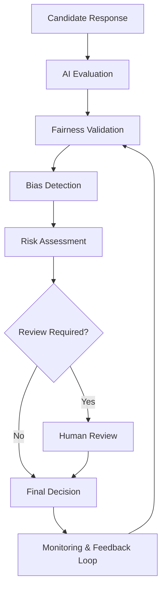
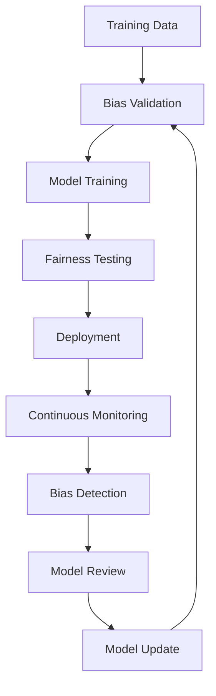
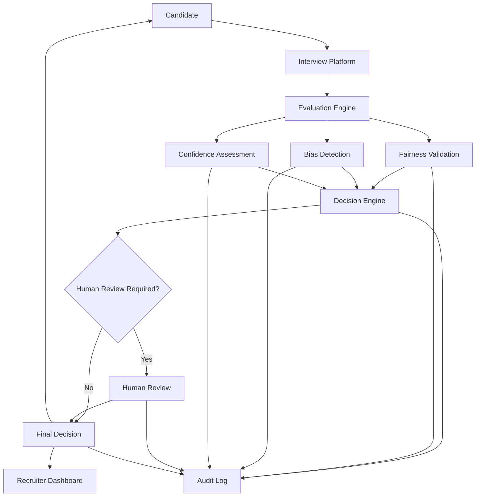
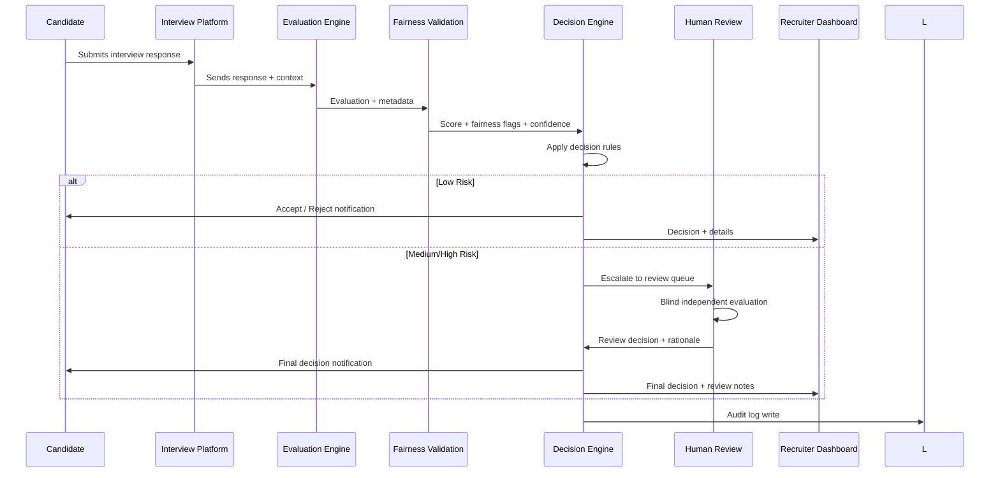
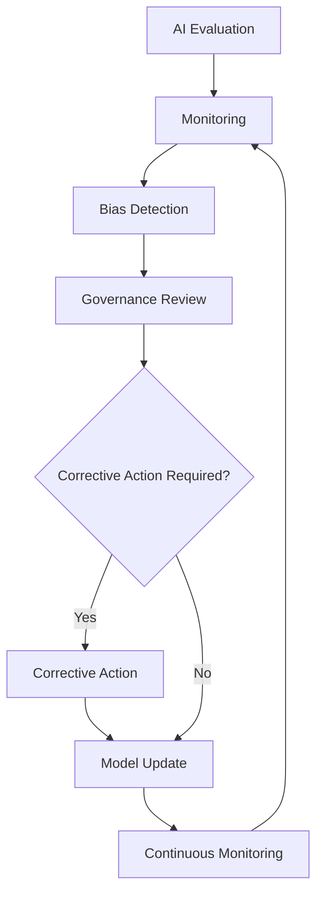
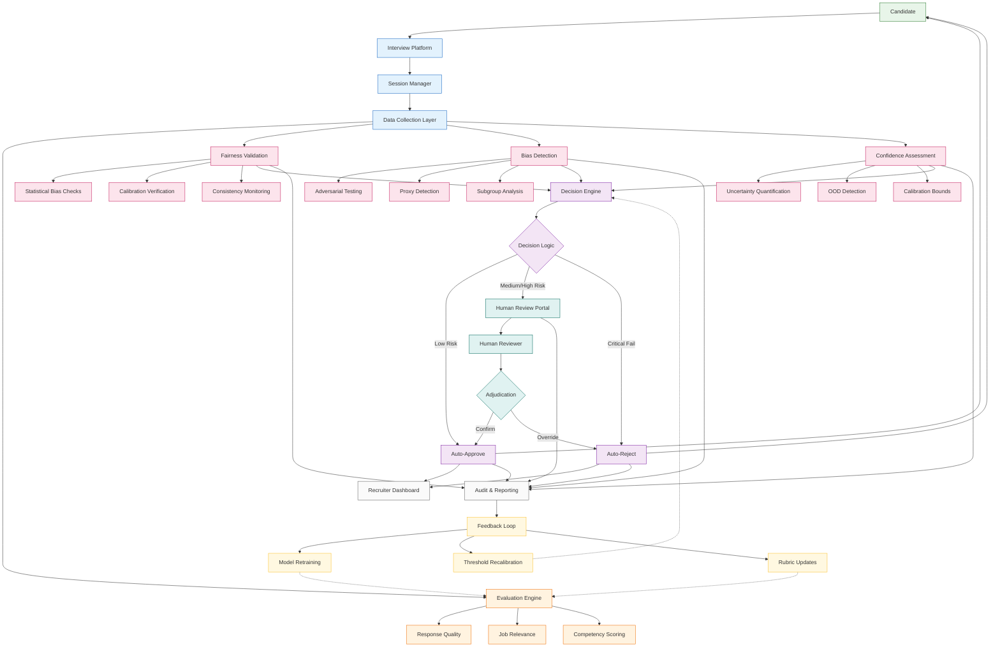
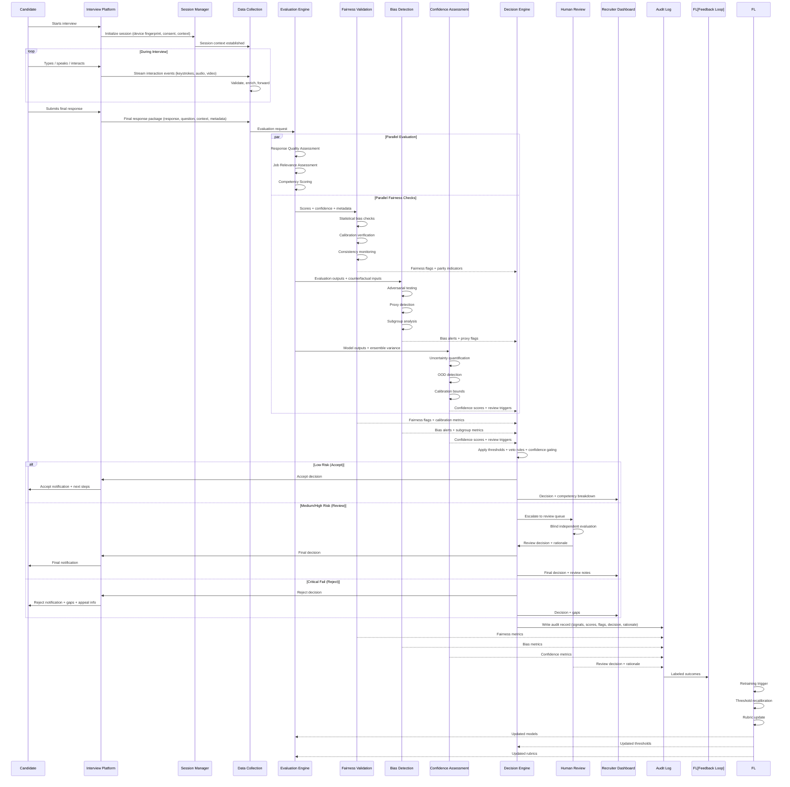
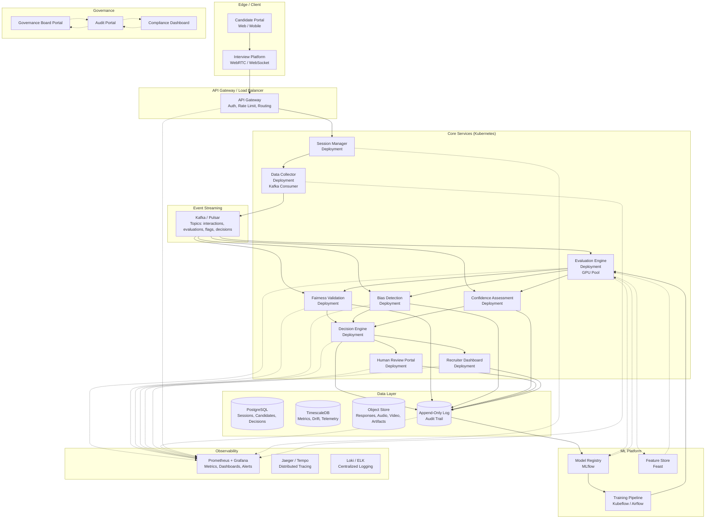

# Challenge 3: Design a Fair AI Interview Evaluation System

## Introduction

## Problem Statement

## Question 1: Fairness Challenges

### 1.1 Fairness Objectives

Fairness is essential in AI-based interview evaluation because these systems directly affect candidates' career opportunities and organizations' talent acquisition outcomes. Unlike traditional software where errors may cause inconvenience, unfair interview evaluations can systematically disadvantage entire demographic groups, perpetuate historical inequities, and expose organizations to legal liability.

**Equal Opportunity**: Every candidate should be assessed solely on job-relevant competencies, regardless of demographic characteristics. The evaluation system must not systematically advantage or disadvantage candidates based on protected attributes such as gender, race, age, or disability status.

**Consistent Evaluation**: The same response quality should receive the same score regardless of who delivers it. Inconsistency in how the AI evaluates similar content from different demographic groups indicates a fairness violation that undermines the validity of the entire assessment process.

**Bias Reduction**: Historical hiring data often reflects past discriminatory practices. An AI system trained on such data will learn and amplify these biases unless explicitly designed to detect and mitigate them. Proactive bias reduction is not optional—it is a prerequisite for legitimate use.

**Trust and Transparency**: Candidates, recruiters, and regulators must trust that the evaluation is fair. Without transparency into how decisions are made and confidence that fairness has been rigorously validated, adoption will be resisted and the system's legitimacy questioned.

**Regulatory Compliance**: Emerging regulations (EU AI Act, NYC Local Law 144, EEOC guidance) require demonstrable fairness in automated employment decisions. Non-compliance carries financial penalties, legal exposure, and reputational damage.

---

### 1.2 Sources of Bias

| Source | Description | Potential Impact | Risk Level |
|--------|-------------|------------------|------------|
| **Gender bias** | System rates responses differently based on gender-associated language patterns, communication styles, or historical gender imbalances in training data | Systematic scoring disparities; qualified candidates of one gender consistently rated lower | High |
| **Race / ethnicity bias** | Training data reflects historical hiring disparities; linguistic features correlated with racial/ethnic groups penalized | Disproportionate rejection of minority candidates; reinforcement of workforce homogeneity | High |
| **Age bias** | Evaluation favors communication styles, terminology, or experience framing typical of certain age groups | Older or younger candidates systematically disadvantaged regardless of competency | Medium |
| **Language proficiency** | Non-native speakers penalized for grammatical variations, vocabulary choices, or fluency markers unrelated to job performance | Qualified candidates rejected due to language differences rather than skill gaps | High |
| **Accent bias** | Speech recognition or prosody analysis disfavors regional, national, or cultural accents | Spoken response evaluations unfairly lower scores for accented speech | High |
| **Educational background** | System favors vocabulary, structure, or references typical of elite institutions | Candidates from non-traditional educational paths disadvantaged | Medium |
| **Socioeconomic background** | Evaluation correlates with access to coaching, preparation resources, or cultural capital | Privilege compounds; system rewards preparation access rather than inherent ability | Medium |
| **Disability bias** | Speech, typing, or interaction patterns affected by disability flagged as anomalies or low quality | Candidates with disabilities systematically scored lower despite equivalent competency | High |
| **Interview question bias** | Questions themselves favor certain cultural contexts, experiences, or communication norms | Structural unfairness embedded before evaluation begins | High |
| **Historical training data bias** | Training labels reflect past biased human decisions; system learns to replicate discriminatory patterns | All above biases encoded and amplified at scale | Critical |

---

### 1.3 Fairness Signals

| Signal | Purpose | Why It Matters |
|--------|---------|----------------|
| **Score distribution** | Monitor score distributions across demographic groups | Detects systematic scoring shifts; early indicator of disparate impact |
| **Acceptance rate** | Track pass/fail rates by protected attribute | Direct measure of disparate impact; regulatory compliance metric |
| **Rejection rate** | Monitor rejection rates by subgroup | Identifies groups disproportionately screened out |
| **Confidence score** | Track model confidence across subgroups | Low confidence for specific groups indicates poor generalization |
| **Human override rate** | Measure how often human reviewers disagree with AI by subgroup | High override rates for specific groups signal evaluation problems |
| **Appeal rate** | Track candidate appeals and outcomes by demographic | Candidate-perceived unfairness; detects issues automated metrics miss |
| **Error rate** | False positive/negative rates by protected attribute | Core fairness metric; equalized odds / equal opportunity assessment |
| **Consistency score** | Measure evaluation stability for similar responses across groups | Inconsistency indicates unstable or biased decision boundaries |
| **Reviewer agreement** | Inter-rater reliability between AI and human evaluators by subgroup | Low agreement for specific groups signals biased or unreliable AI evaluation |

---

### 1.4 Fairness Risk Assessment

| Risk | Likelihood | Impact | Mitigation Priority |
|------|------------|--------|---------------------|
| **Disparate impact on protected groups** | High | Critical (legal, reputational, ethical) | Critical |
| **Model drift causing emergent bias** | Medium | High (gradual degradation undetected) | High |
| **Insufficient demographic representation in training data** | High | High (fundamental limitation) | Critical |
| **Proxy variables encoding protected attributes** | Medium | High (covert discrimination) | High |
| **Evaluation criteria misaligned with job requirements** | Medium | High (invalid assessment) | High |
| **Human reviewer bias amplifying AI bias** | Medium | Medium (compounds system bias) | Medium |
| **Inadequate appeal/redress mechanisms** | Low | High (regulatory violation) | High |
| **Lack of transparency into decision rationale** | Medium | Medium (trust erosion) | Medium |
| **Cross-context generalization failure** | Medium | High (deployment in new roles/contexts) | High |
| **Adversarial manipulation of fairness metrics** | Low | Medium (gaming audits) | Medium |

---

### 1.5 Fairness Strategy

A single fairness check is insufficient because bias can enter at multiple stages—data collection, feature engineering, model training, evaluation, and deployment—and can evolve over time. A **layered defense** approach ensures that if one layer fails, others provide protection.

**Layer 1: Dataset Quality** — Curate balanced representation across demographic groups in training data; de-bias historical labels; augment underrepresented groups; validate label quality through expert review. Addresses root cause: biased training signal.

**Layer 2: Blind Evaluation** — Remove or mask demographic proxies (names, locations, institutions, photos) from inputs; use structured rubrics focused on job-relevant competencies; standardize evaluation format. Prevents direct attribute-based discrimination.

**Layer 3: Bias Detection** — Continuous statistical monitoring (disparate impact, equalized odds, demographic parity); subgroup performance analysis; adversarial testing with synthetic counterfactual inputs. Detects bias that emerges despite preventive layers.

**Layer 4: Human Oversight** — Trained human reviewers evaluate flagged cases; blind review of AI decisions; diverse reviewer pool; calibrated decision thresholds per subgroup if justified. Provides judgment where statistical metrics are insufficient.

**Layer 5: Continuous Auditing** — Scheduled third-party audits; automated drift detection; fairness regression tests in CI/CD; incident response for fairness violations; public transparency reports. Ensures sustained compliance and accountability.

---

### 1.6 Fairness Workflow

---

### 1.7 Fairness Strategy Summary

| Layer | Focus | Key Actions | Frequency | Owner |
|-------|-------|-------------|-----------|-------|
| **1. Dataset Quality** | Training data integrity | Balanced representation, label de-biasing, augmentation, expert validation | Pre-training + quarterly refresh | Data Engineering |
| **2. Blind Evaluation** | Input sanitization | Demographic proxy removal, structured rubrics, format standardization | Per evaluation | Platform Engineering |
| **3. Bias Detection** | Statistical monitoring | Disparate impact analysis, equalized odds, subgroup metrics, adversarial testing | Continuous + weekly reports | ML Engineering |
| **4. Human Oversight** | Expert judgment | Blind review of flagged cases, diverse reviewer pool, calibrated thresholds | Per escalation + monthly calibration | Talent Acquisition |
| **5. Continuous Auditing** | Sustained compliance | Third-party audits, drift detection, regression tests, transparency reports | Quarterly + incident-driven | Governance / Compliance |

---

## Question 2: Bias Detection & Mitigation

### 2.1 Bias Detection Framework

Bias detection must operate continuously across the entire AI evaluation lifecycle—from data collection through post-deployment monitoring. A single point-in-time audit is insufficient because bias can emerge at any stage and evolve as data distributions, candidate populations, and model behavior change.

**Dataset Bias** — Detected during data collection and preparation. Analysis examines demographic representation in training data, label quality across subgroups, feature distributions that may encode protected attributes, and historical outcome disparities. Tools include subgroup size analysis, label distribution comparisons, proxy variable detection, and counterfactual fairness testing on raw data.

**Model Bias** — Detected during model development and validation. Analysis evaluates whether learned representations encode demographic information, whether feature importance varies by subgroup, and whether model architecture choices amplify disparities. Tools include representation analysis, feature attribution by subgroup, adversarial probing, and invariance testing across demographic splits.

**Prediction Bias** — Detected during validation and post-deployment. Analysis measures whether model outputs (scores, rankings, pass/fail decisions) differ systematically across protected groups after controlling for job-relevant qualifications. Tools include disparate impact analysis, equalized odds evaluation, calibration curves by subgroup, and counterfactual prediction testing.

**Human Reviewer Bias** — Detected during human-in-the-loop operations. Analysis examines whether human reviewers systematically override AI decisions for specific subgroups, whether reviewer agreement varies by candidate demographics, and whether reviewer fatigue or calibration drift introduces bias. Tools include inter-rater reliability by subgroup, override pattern analysis, and reviewer calibration tracking.

**Feedback Loop Bias** — Detected in continuous learning systems. Analysis examines whether retraining on human-validated decisions amplifies existing biases, whether appeal outcomes are incorporated equitably, and whether new training data maintains demographic balance. Tools include retraining impact simulation, label shift detection, and demographic parity monitoring in updated datasets.

---

### 2.2 Bias Detection Metrics

| Metric | Purpose | Interpretation |
|--------|---------|----------------|
| **Demographic Parity** | Measures whether selection rates are equal across demographic groups | Ratio of selection rates between groups; values close to 1.0 indicate parity; < 0.8 (4/5 rule) suggests disparate impact |
| **Equal Opportunity** | Measures whether true positive rates are equal across groups for qualified candidates | Ratio of true positive rates; ensures qualified candidates from all groups have equal chance of being selected |
| **Equalized Odds** | Measures whether both true positive and false positive rates are equal across groups | Stronger than equal opportunity; requires both TPR and FPR parity; ensures fair treatment of qualified and unqualified candidates alike |
| **False Positive Rate** | Measures rate of incorrectly passing unqualified candidates by group | Higher FPR for a group means more unqualified candidates from that group pass; indicates leniency bias |
| **False Negative Rate** | Measures rate of incorrectly failing qualified candidates by group | Higher FNR for a group means more qualified candidates from that group are rejected; indicates harshness bias |
| **Selection Rate** | Overall pass/fail rate by demographic group | Baseline metric for disparate impact analysis; regulatory threshold often 4/5 rule (80% of highest group's rate) |
| **Calibration** | Measures whether predicted scores correspond to actual outcomes equally across groups | A score of 80 should mean 80% chance of success for all groups; miscalibration for a group indicates unreliable predictions |
| **Human Override Rate** | Measures frequency of human reviewers changing AI decisions by candidate group | Higher override rates for specific groups may indicate AI bias or reviewer bias; requires investigation |
| **Appeal Success Rate** | Measures proportion of candidate appeals that result in decision reversal by group | Higher success rates for specific groups suggest systematic evaluation errors for those candidates |
| **Consistency Score** | Measures evaluation stability for similar responses across demographic groups | Lower consistency for specific groups indicates unstable decision boundaries or biased feature weighting |

---

### 2.3 Bias Mitigation Strategies

| Strategy | Stage Applied | Objective | Expected Benefit |
|----------|---------------|-----------|------------------|
| **Balanced training data** | Data preparation | Ensure proportional demographic representation in training data; augment underrepresented groups | Reduces representation bias at source; improves model generalization to all groups |
| **Blind evaluation** | Input processing | Remove or mask demographic proxies (names, institutions, locations, photos) from inputs | Prevents direct discrimination; forces model to rely on job-relevant features only |
| **Data quality validation** | Data preparation | Verify label accuracy across subgroups; detect and correct mislabeled examples; validate feature distributions | Ensures training signal is fair and accurate; prevents garbage-in-garbage-out bias amplification |
| **Bias-aware model validation** | Model development | Evaluate model on fairness metrics alongside accuracy; use adversarial validation; test on synthetic counterfactuals | Catches bias before deployment; ensures fairness is a release criterion, not an afterthought |
| **Human review** | Post-prediction | Escalate medium-risk and edge cases to trained human reviewers; blind review process | Provides judgment where statistical metrics are insufficient; catches context-dependent bias |
| **Threshold review** | Decision logic | Calibrate decision thresholds per subgroup if justified by business necessity and validated fairness | Enables equalized odds where single threshold fails; requires rigorous justification |
| **Continuous monitoring** | Production | Real-time tracking of fairness metrics; automated alerts on threshold breaches; dashboard visibility | Early detection of emergent bias; enables rapid response before widespread impact |
| **Periodic retraining** | Model maintenance | Retrain on updated, balanced datasets; validate fairness on holdout sets before promotion | Adapts to population shifts; refreshes model with current fair data; prevents stale bias |
| **Fairness auditing** | Governance | Scheduled internal/external audits; regression testing; transparency reporting; regulatory alignment | Provides independent verification; builds stakeholder trust; ensures regulatory compliance |
| **Candidate appeal process** | Redress | Accessible, timely appeal mechanism; independent review; outcome tracking by demographic group | Provides safety net for individual errors; detects systematic issues missed by aggregate metrics; builds trust |

---

### 2.4 Bias Monitoring Process

**Continuous Monitoring** — Automated dashboards track all fairness metrics in real time across demographic groups. Automated alerts trigger when metrics cross predefined thresholds (e.g., demographic parity ratio < 0.8, calibration error > 0.05, override rate disparity > 2x). Monitoring covers score distributions, selection rates, error rates, calibration curves, and human override patterns—all segmented by protected attributes.

**Periodic Fairness Audits** — Quarterly deep-dive audits conducted by independent internal team or external auditor. Audits include: full metric recomputation on latest data, counterfactual testing with synthetic candidates, adverse impact analysis per regulatory frameworks, review of edge cases and human overrides, assessment of appeal outcomes, and documentation of findings with remediation plans.

**Performance Drift Detection** — Statistical process control charts monitor model performance metrics (accuracy, AUC, calibration) and fairness metrics over time. CUSUM and EWMA control charts detect gradual drift before it crosses alert thresholds. Population stability index (PSI) monitors input feature distribution shifts that may precede fairness degradation.

**Reviewer Calibration** — Monthly calibration sessions where all human reviewers evaluate the same benchmark candidate set. Inter-rater reliability (Fleiss' κ) tracked per reviewer and overall. Reviewers whose agreement with gold-standard falls below threshold undergo retraining. Calibration drift triggers review of recent override decisions.

**Governance Reviews** — Monthly governance board reviews covering: fairness metric trends, audit findings, incident reports, appeal outcomes, regulatory updates, and remediation status. Decisions documented with owners and deadlines. Escalation path to executive leadership for critical fairness violations.

---

### 2.5 Bias Mitigation Workflow

---

### 2.6 Bias Detection & Mitigation Summary

| Lifecycle Stage | Detection Activities | Mitigation Actions | Metrics Tracked | Frequency | Owner |
|-----------------|---------------------|-------------------|-----------------|-----------|-------|
| **Data Preparation** | Representation analysis, label quality check, proxy detection | Balanced sampling, label correction, augmentation | Subgroup sizes, label distributions, proxy correlations | Pre-training | Data Engineering |
| **Model Development** | Fairness-aware validation, adversarial testing, counterfactual evaluation | Architecture constraints, fairness regularization, threshold tuning | DP, EO, EOdds, calibration, FPR/FNR by group | Per experiment | ML Engineering |
| **Pre-Deployment** | Full audit on holdout sets, regulatory compliance check, stakeholder review | Go/no-go decision, threshold finalization, monitoring setup | All fairness metrics, audit findings | Per release | ML Engineering + Governance |
| **Production** | Real-time dashboards, automated alerts, drift detection | Automated threshold escalation, human review routing | All metrics + override rates, appeal rates | Continuous | ML Engineering + Operations |
| **Quarterly** | Independent audit, counterfactual testing, appeal review, reviewer calibration | Remediation planning, retraining trigger, policy updates | Audit findings, trend analysis, compliance status | Quarterly | Governance / Compliance |
| **Incident Response** | Root cause analysis, impact assessment, affected candidate identification | Emergency threshold adjustment, model rollback, candidate remediation | Incident-specific metrics | As needed | ML Engineering + Legal + TA |

---

## Question 3: Fair Evaluation System Design

### 3.1 System Overview

The fair AI interview evaluation system provides end-to-end assessment of candidate responses with built-in fairness safeguards at every stage. The system processes candidate interview responses through a multi-layered evaluation pipeline that combines AI-based competency scoring with continuous fairness validation, human oversight for edge cases, and transparent decision-making.

**Candidate Journey**: A candidate completes an interview (text, audio, or video) on the interview platform. Their response is captured along with metadata (question context, interview type, candidate demographics if voluntarily provided). The response enters the evaluation pipeline where AI assesses competency relevance, communication quality, and job alignment. Fairness validation runs in parallel, checking for bias indicators across demographic subgroups. Based on confidence and fairness scores, the decision engine either renders an automated accept/reject or escalates to human review. Candidates receive structured feedback; recruiters receive calibrated scores with fairness indicators.

**AI Evaluation**: Multiple specialized models evaluate different competency dimensions—technical knowledge, problem-solving, communication, cultural alignment—each trained on job-relevant criteria and validated for subgroup fairness.

**Fairness Validation**: Every evaluation passes through real-time bias detection checking score distributions, confidence calibration, and consistency across demographic subgroups. Anomalies trigger escalation.

**Human Review**: Trained reviewers evaluate flagged cases blind to AI scores and candidate demographics, using structured rubrics. Their decisions feed back into model calibration.

**Final Decision**: The decision engine combines AI scores, fairness indicators, and human input (if applicable) into a final accept/review/reject outcome with full audit trail.

---

### 3.2 Evaluation Inputs

| Input | Purpose | Fairness Consideration |
|-------|---------|------------------------|
| **Candidate response** | Primary content for competency assessment | Anonymized before evaluation; demographic proxies removed |
| **Interview question** | Defines evaluation context and expected competencies | Questions pre-validated for cultural neutrality and job relevance |
| **Job requirements** | Defines competency targets and success criteria | Requirements structured as measurable competencies, not proxies |
| **Evaluation rubric** | Standardized scoring criteria for each competency | Rubrics focus on observable behaviors; calibrated across reviewers |
| **Historical benchmark responses** | Reference examples for calibration and consistency | Benchmarks balanced across demographic groups; regularly refreshed |
| **Human reviewer feedback** | Ground truth labels for model calibration and training | Reviewer pool diverse; feedback aggregated to minimize individual bias |
| **Candidate appeal outcome** | Correction signal for systematic errors | Appeal patterns monitored for demographic disparities |
| **Confidence score** | Uncertainty estimate for each evaluation dimension | Low confidence triggers human review regardless of score |
| **Interview metadata** | Context: interview type, duration, format, interviewer | Used only for contextual normalization; not for scoring |
| **Assessment context** | Role level, department, hiring stage, team composition | Context-aware thresholds; prevents cross-role score comparison |

---

### 3.3 Fair Evaluation Engine

The evaluation engine is a modular pipeline where each stage contributes to a holistic, fairness-aware assessment.

**Response Quality Assessment** — Evaluates linguistic clarity, structural coherence, completeness, and relevance to the question. Uses readability metrics, semantic coherence scoring, and completeness checks against question requirements. Non-native speaker variations accounted for through dialect-robust models.

**Job Relevance Assessment** — Maps response content to job competency framework using semantic similarity, keyword coverage, and behavioral indicator extraction. Competency mapping validated by subject matter experts and tested for subgroup equivalence.

**Fairness Validation** — Real-time statistical checks on the evaluation output: score distributions by demographic subgroup, confidence calibration parity, consistency with historical benchmarks, and proxy variable detection. Runs in parallel with core evaluation; anomalies flagged for review.

**Bias Detection** — Adversarial probing with counterfactual inputs (same content, varied demographic markers) to detect proxy discrimination. Subgroup performance analysis across all competency dimensions. Continuous monitoring for emergent bias patterns.

**Confidence Estimation** — Uncertainty quantification for each competency score using ensemble variance, calibration error bounds, and out-of-distribution detection. Low confidence on any dimension triggers human review pathway.

**Overall Evaluation Score** — Weighted aggregation of competency scores with fairness adjustments. Weights derived from job analysis. Fairness adjustments apply only when statistical evidence of bias exceeds threshold; adjustments logged and auditable. Final score includes confidence interval and fairness flags.

---

### 3.4 Decision Engine

The decision engine translates evaluation outputs into three deterministic outcomes with clear criteria and audit trails.

**Accept** — Granted when: overall score exceeds acceptance threshold AND all competency scores meet minimums AND confidence score exceeds calibration threshold AND no fairness flags triggered. Candidate receives automated notification with score summary and next steps.

**Human Review** — Triggered when ANY condition met: score near threshold (within calibrated margin) OR confidence below threshold OR fairness flag raised (disparate impact, calibration drift, consistency violation) OR competency score below minimum in critical dimension OR candidate appeal filed. Review queue prioritized by risk level; reviewer sees anonymized response, rubric, benchmark comparisons, and fairness flags—but not AI score or demographics.

**Reject** — Applied when: overall score below rejection threshold OR multiple critical competencies below minimum OR fundamental job requirement unmet AND no mitigating fairness concerns. Rejection includes specific competency gaps and development suggestions. Candidate receives structured feedback with appeal instructions.

**Candidate Notification** — All outcomes communicated via standardized templates: Accept includes next steps and timeline; Review includes expected timeline and what to expect; Reject includes specific gaps, resources for improvement, and appeal process.

**Recruiter Notification** — Recruiters receive: final decision, competency breakdown, confidence indicators, fairness flags (if any), review notes (if reviewed), and comparative benchmarks. No raw demographic data exposed.

---

### 3.5 Human Review

**When Review Is Required** — Human review is mandatory for: borderline scores (within ±5 points of threshold), low confidence evaluations (<0.7 calibrated confidence), fairness flags (any bias detection trigger), critical competency failures, candidate appeals, and random sample (5%) for quality assurance.

**Review Workflow** — Flagged cases enter prioritized queue. Reviewer receives: anonymized candidate response, interview question, job competency requirements, evaluation rubric with behavioral anchors, benchmark responses (high/medium/low quality), and fairness flags summary. Reviewer does NOT see: AI scores, candidate name, demographics, or institution names.

**Reviewer Responsibilities** — Evaluate response against rubric independently; assign competency ratings with written justification; confirm or override fairness flags; flag any new concerns; record decision confidence (1–5). Reviewers calibrated monthly on shared benchmark sets.

**Appeal Handling** — Candidates may appeal within 14 days. Appeal reviewed by senior reviewer not involved in original decision. Appeal package includes original response, evaluation details, fairness flags, and candidate statement. Outcome: uphold, modify score, or order re-evaluation. Appeal trends analyzed quarterly for systemic issues.

**Final Approval Process** — Post-review, decision engine reconciles AI evaluation with human judgment. If aligned, decision finalized. If divergent, senior adjudicator resolves with documented rationale. All decisions, overrides, and rationales logged immutably in audit trail.

---

### 3.6 System Architecture

---

### 3.7 End-to-End Workflow

---

### 3.8 System Design Summary

| Component | Responsibility | Inputs | Outputs |
|-----------|----------------|--------|---------|
| **Interview Platform** | Candidate interaction, response capture, metadata collection | Candidate response, question, context | Anonymized response package |
| **Evaluation Engine** | Competency scoring, quality assessment, relevance mapping | Response, question, rubric, job requirements | Competency scores, quality metrics, relevance scores |
| **Fairness Validation** | Statistical bias checks, calibration verification, consistency monitoring | Scores, confidence, subgroup metadata | Fairness flags, calibration metrics, parity indicators |
| **Bias Detection** | Adversarial testing, proxy detection, subgroup analysis | Evaluation outputs, counterfactual inputs | Bias alerts, proxy variable flags, subgroup metrics |
| **Confidence Assessment** | Uncertainty quantification, OOD detection, calibration bounds | Model outputs, ensemble variance | Confidence scores, review triggers |
| **Decision Engine** | Threshold application, outcome determination, notification routing | Scores, flags, confidence, fairness indicators | Accept / Review / Reject decision |
| **Human Review** | Blind adjudication, fairness flag verification, quality assurance | Anonymized response, rubric, benchmarks, flags | Independent ratings, override decisions, rationales |
| **Recruiter Dashboard** | Decision presentation, competency breakdown, fairness transparency | Final decisions, review notes, metrics | Hiring recommendations, compliance reports |
| **Audit Log** | Immutable record of all evaluations, decisions, reviews, overrides | All system events, decisions, rationales | Compliance trail, audit evidence, retraining data |

---

## Question 4: Governance & Monitoring

### 4.1 Governance Framework

The governance framework establishes accountability, oversight, and decision-making structures for the AI interview evaluation system. It ensures the system operates within ethical, legal, and organizational boundaries while maintaining evaluation quality and fairness.

**Governance Board** — Cross-functional body (Legal, Compliance, Talent Acquisition, ML Engineering, Diversity & Inclusion) meeting monthly to review system performance, fairness metrics, regulatory changes, and strategic decisions. Authority to mandate model changes, threshold adjustments, or system pauses.

**Policy Management** — Documented policies covering: acceptable use, data handling, candidate rights, reviewer standards, appeal procedures, model change management, and vendor management. Policies version-controlled with change approval workflows.

**Roles & Responsibilities** — Clear ownership matrix: ML Engineering (model performance, fairness metrics), Talent Acquisition (business requirements, recruiter experience), Legal/Compliance (regulatory adherence, risk assessment), Operations (system reliability, monitoring), Governance Board (strategic oversight, policy approval).

**Change Control** — All model, threshold, rubric, and policy changes require: impact assessment (fairness, accuracy, candidate experience), stakeholder review, Governance Board approval for high-impact changes, deployment validation, and post-deployment monitoring.

**Vendor & Third-Party Management** — Contracts and SLAs for any external AI services, data providers, or audit firms include fairness requirements, audit rights, data protection clauses, and incident notification timelines.

---

### 4.2 Continuous Monitoring

Continuous monitoring provides real-time visibility into system health, fairness, and performance. It enables early detection of degradation, bias emergence, or operational issues before they significantly impact candidates or hiring outcomes.

**Real-Time Dashboards** — Live views of: fairness metrics by demographic group, model performance (accuracy, calibration), decision distributions (accept/review/reject rates), human override patterns, appeal volumes, reviewer workload, system latency, and error rates. Segmented by role, department, geography, and interview type.

**Automated Alerting** — Threshold-based alerts for: fairness metric breaches (e.g., demographic parity < 0.8), calibration drift (ECE > 0.05), performance degradation (accuracy drop > 2%), unusual override or appeal spikes, reviewer calibration drift, data quality anomalies. Alerts routed to ML Engineering and Governance with severity-based SLAs.

**Drift Detection** — Population Stability Index (PSI) on input features, prediction distribution shifts, concept drift via labeled outcome tracking, feature importance stability monitoring. Automatic retraining triggers when drift exceeds thresholds.

**Reviewer Calibration Tracking** — Monthly inter-rater reliability (Fleiss' κ) per reviewer and overall; override rate trends; decision confidence distributions; time-to-decision. Reviewers falling below calibration thresholds enter remediation.

**Data Quality Monitoring** — Input completeness, schema validation, label quality, demographic representation in live traffic, missing data patterns. Prevents silent degradation from upstream data issues.

---

### 4.3 Bias Monitoring Metrics

| Metric | Purpose | Monitoring Frequency |
|--------|---------|---------------------|
| **Fairness Score** | Composite index of demographic parity, equal opportunity, equalized odds across protected groups | Continuous (dashboard) + Weekly report |
| **Model Accuracy** | Overall and per-subgroup classification accuracy; ensures performance not sacrificed for fairness | Continuous + Weekly |
| **Human Override Rate** | Frequency of human reviewers changing AI decisions; segmented by candidate demographics | Continuous + Weekly |
| **Appeal Rate** | Candidate appeal volume and success rate by demographic group; detects perceived unfairness | Weekly |
| **Reviewer Agreement** | Inter-rater reliability (Fleiss' κ) among human reviewers; overall and by candidate subgroup | Monthly |
| **False Positive Rate** | Rate of unqualified candidates passing; by demographic group to detect leniency bias | Continuous + Weekly |
| **False Negative Rate** | Rate of qualified candidates rejected; by demographic group to detect harshness bias | Continuous + Weekly |
| **Drift Score** | Population Stability Index (PSI) on features and predictions; concept drift indicators | Continuous + Daily |
| **Compliance Status** | Regulatory checklist status (EU AI Act, NYC LL144, EEOC); audit readiness indicators | Weekly + Quarterly formal |
| **Audit Completion Rate** | Percentage of scheduled audits (internal/external) completed on time with findings resolved | Quarterly |

---

### 4.4 Incident Management

A structured incident management process ensures fairness and governance incidents are detected, investigated, and resolved systematically with appropriate stakeholder communication.

**Incident Detection** — Incidents detected via: automated monitoring alerts (fairness metric breaches, drift alerts), candidate appeals/complaints, recruiter reports, reviewer escalations, audit findings, external reports, scheduled audit findings. All incidents logged in centralized tracking system with timestamp, source, severity, and affected candidates.

**Risk Classification** — Four-tier severity model: **Critical** (systemic bias affecting protected group, regulatory violation, >100 candidates impacted); **High** (measurable fairness degradation, >20 candidates, audit finding); **Medium** (localized bias, threshold breach self-corrected, <20 candidates); **Low** (single-candidate appeal, minor metric fluctuation self-resolved). Classification determines response timeline and escalation path.

**Investigation** — Assigned investigator (ML Engineering + Legal/Compliance) conducts root cause analysis: affected candidate identification, timeline reconstruction, metric trend analysis, code/data/model change review, counterfactual testing. Investigation scope proportional to severity. Documentation maintained for audit trail.

**Corrective Actions** — Based on root cause: emergency threshold adjustment, model rollback to last validated version, targeted retraining with balanced data, rubric/threshold revision, reviewer retraining, process change. Actions validated on holdout data before deployment. Affected candidates notified and remediated (re-evaluation, appeal prioritization).

**Communication** — Structured communication plan per severity: Critical/High — executive notification within 2 hours, candidate notification within 24 hours, regulator notification per legal requirement; Medium — stakeholder notification within 24 hours; Low — routine logging. All communications documented.

**Post-Incident Review** — Within 14 days: incident retrospective with all stakeholders, root cause documentation, corrective action effectiveness assessment, process improvement recommendations, policy/procedure updates, preventive controls implementation. Review outcomes reported to Governance Board.

---

### 4.5 Governance Workflow

---

### 4.6 Governance Summary

| Governance Area | Objective | Owner | Review Frequency |
|-----------------|-----------|-------|------------------|
| **Governance Board Oversight** | Strategic direction, policy approval, risk acceptance | Governance Board (Legal, TA, ML, D&I) | Monthly |
| **Model Performance & Fairness** | Accuracy, calibration, fairness metrics tracking | ML Engineering | Continuous + Weekly |
| **Bias Detection & Mitigation** | Automated bias monitoring, drift detection, alerting | ML Engineering + Governance | Continuous + Weekly |
| **Human Review Operations** | Reviewer calibration, override monitoring, quality assurance | Talent Acquisition + ML Engineering | Monthly |
| **Candidate Appeals & Redress** | Appeal processing, trend analysis, remediation tracking | Legal + Talent Acquisition | Weekly + Quarterly |
| **Regulatory Compliance** | EU AI Act, NYC LL144, EEOC adherence; audit readiness | Legal/Compliance | Quarterly + Ongoing |
| **Audit & Accountability** | Internal/external audit execution, finding remediation | Governance/Compliance | Quarterly |
| **Change Control** | Model, threshold, rubric, policy change approval | Governance Board | Per change |
| **Vendor & Third-Party Risk** | Contract compliance, audit rights, incident notification | Legal/Procurement | Semi-annual |
| **Incident Management** | Detection, investigation, correction, communication, review | ML Engineering + Legal | As needed + 14-day review |
| **Reviewer Calibration** | Inter-rater reliability, override patterns, decision quality | Talent Acquisition + ML Engineering | Monthly |
| **Data Quality & Representation** | Input data integrity, demographic balance, label quality | Data Engineering + ML Engineering | Continuous + Weekly |

---
## Overall Architecture

### 1. Architecture Overview

The Fair AI Interview Evaluation System follows a **layered, event-driven architecture** designed for real-time candidate assessment with continuous fairness validation. The architecture separates concerns into distinct layers: interaction, evaluation, fairness, decision, and governance—each independently deployable and scalable.

At a high level, the flow proceeds as follows: A **Candidate** completes an interview on the **Interview Platform**, which captures the response and metadata. The **Session Manager** initializes an evaluation session and streams interaction events to the **Data Collection Layer**. During the assessment, the **Evaluation Engine** scores the response across competency dimensions. In parallel, the **Fairness Validation** and **Bias Detection** services analyze the evaluation outputs for statistical anomalies and proxy discrimination. The **Confidence Assessment** quantifies uncertainty. All signals feed the **Decision Engine**, which applies calibrated thresholds and veto rules to produce one of three outcomes: **Auto-Approve**, **Human Review**, or **Auto-Reject**. Escalated cases route to the **Human Review Portal** for blind adjudication. Every signal, score, flag, decision, and review action is written to the **Audit & Reporting** store. The **Feedback Loop** service consumes review outcomes, appeal outcomes, and audit findings to trigger model retraining, threshold recalibration, and rubric updates.

The system emphasizes **defense in depth**: fairness checks run in parallel with core evaluation (not sequentially), blind review eliminates confirmation bias, confidence gating catches out-of-distribution inputs, and veto logic on critical competencies prevents compensation by strengths in other areas.

---

### 2. Component Architecture

---

### 3. Component Responsibilities

| Component | Role |
|-----------|------|
| **Interview Platform** | Delivers interview experience (text/audio/video), captures responses, collects metadata, manages candidate identity and consent |
| **Session Manager** | Initializes evaluation sessions, manages session lifecycle, enforces time limits, handles reconnection |
| **Data Collection Layer** | Receives streaming interaction events (keystrokes, audio chunks, video frames), validates schema, enriches with context, forwards to message bus |
| **Evaluation Engine** | Orchestrates multi-model inference: response quality, job relevance, competency scoring; aggregates weighted competency scores |
| **Fairness Validation** | Real-time statistical checks: score distribution parity, calibration parity, consistency with benchmarks, proxy variable detection |
| **Bias Detection** | Adversarial probing (counterfactual inputs), proxy variable detection, subgroup performance analysis, continuous monitoring for emergent patterns |
| **Confidence Assessment** | Uncertainty quantification via ensemble variance, calibration error bounds, out-of-distribution detection; produces per-dimension confidence scores |
| **Decision Engine** | Applies calibrated thresholds, veto rules (critical competency minimums), confidence gating, fairness flag routing; produces Accept / Review / Reject |
| **Human Review Portal** | Blind adjudication UI: anonymized response, rubric, benchmarks, fairness flags; records independent ratings, overrides, rationales |
| **Recruiter Dashboard** | Decision presentation, competency breakdown, fairness transparency, compliance reporting, bulk operations |
| **Audit & Reporting** | Immutable append-only log of all events, scores, flags, decisions, reviews, overrides, appeals; tamper-evident, queryable for audits |
| **Feedback Loop** | Consumes review outcomes, appeal outcomes, audit findings; triggers model retraining, threshold recalibration, rubric updates |

---

### 3. Data Flow

---

### 4. Deployment Architecture

---

### 5. Design Principles

| Principle | Implementation |
|-----------|----------------|
| **Fairness by Design** | Fairness checks run in parallel with evaluation (not post-hoc); veto logic on critical competencies; blind human review; candidate appeal as first-class workflow |
| **Modularity** | Each engine (evaluation, fairness, bias, confidence, decision) is an independently deployable service with well-defined interfaces; enables independent scaling, updating, and testing |
| **Scalability** | Stateless services behind API gateway; horizontal scaling via Kubernetes HPA; event-driven via Kafka for decoupling and backpressure handling; GPU pool for inference |
| **Reliability** | Circuit breakers on model inference; graceful degradation (if fairness validation fails, default to Review); idempotent event processing; multi-AZ deployment |
| **Explainability** | Every decision includes: competency breakdown, confidence intervals, fairness flags, veto reasons, review rationale (if applicable); counterfactual explanations available via API |
| **Auditability** | Immutable append-only audit log (WORM storage) capturing every signal, score, flag, decision, review, override, appeal; WORM storage with cryptographic hashing; retention per policy |
| **Human Oversight** | Blind review (no AI score, no demographics); structured rubrics with behavioral anchors; benchmark comparators; mandatory justification; reviewer calibration tracking |
| **Privacy by Design** | Demographic data stored separately, accessed only for fairness monitoring (not evaluation); candidate consent for optional demographics; data minimization; retention policies; right to deletion |

---

### 6. Architecture Summary Table

| Aspect | Summary |
|--------|---------|
| **Architecture Style** | Layered, event-driven, microservices |
| **Primary Layers** | Interaction → Collection → Evaluation ↔ Fairness/Bias/Confidence (parallel) → Decision → Review → Reporting |
| **Key Data Flows** | Real-time interaction stream → Evaluation + parallel fairness/bias/confidence → Decision → Review (conditional) → Audit |
| **Evaluation Engine** | Multi-model ensemble (quality, relevance, competency); weighted aggregation; fairness adjustments logged |
| **Fairness & Bias** | Parallel statistical validation + adversarial bias detection + proxy detection; continuous; alerts on threshold breach |
| **Decision Model** | Three-tier: Auto-Approve / Human Review / Auto-Reject; veto on critical competencies; confidence gating; calibrated thresholds |
| **Human Review** | Blind, structured, benchmarked, justified, calibrated; senior adjudication for divergence; appeal workflow |
| **Observability** | Prometheus/Grafana metrics; Jaeger tracing; Loki logs; real-time fairness dashboards; automated alerting |
| **MLOps** | Model registry, feature store, automated training pipeline, canary deployment, drift-triggered retraining |
| **Governance** | Governance Board oversight; change control with fairness impact assessment; quarterly audits; incident management |
| **Compliance** | EU AI Act (high-risk AI system), NYC LL144, EEOC; audit trails; bias monitoring; candidate rights (appeal, deletion) |
| **Security** | TLS everywhere, mTLS service-to-service, OAuth2/OIDC auth, RBAC, WORM audit storage, encryption at rest/in transit |

---

## Key Design Decisions

| Decision | Choice | Rationale |
|----------|--------|-----------|
| **Anonymization at ingestion** | Strip all demographic proxies before evaluation | Prevents direct discrimination; forces model to use job-relevant features only |
| **Parallel fairness validation** | Fairness checks run concurrently with evaluation, not sequentially | Zero added latency; fail-safe defaults to Review if validation unavailable |
| **Multi-tier decision (Accept/Review/Reject)** | Three deterministic outcomes with clear criteria | Balances automation efficiency with human judgment for edge cases |
| **Human review for medium-risk** | Blind adjudication with structured rubrics | Prevents confirmation bias from AI scores; eliminates demographic bias in review |
| **Confidence-gated review** | Low confidence triggers review regardless of score | Catches out-of-distribution and uncertain predictions that scores alone miss |
| **Veto logic for critical competencies** | Minimum thresholds on critical dimensions override high overall score | Ensures baseline competence on essential skills; prevents compensation by strengths in other areas |
| **Appeal as first-class workflow** | 14-day appeal window, senior reviewer, re-evaluation option | Provides individual redress; generates high-value correction signals for retraining |
| **Continuous calibration** | Weekly model calibration checks; monthly reviewer calibration | Prevents silent degradation; ensures probability scores remain meaningful |
| **Drift-triggered retraining** | Automatic retraining pipeline on PSI/concept drift exceeding thresholds | Keeps model current with evolving language, candidate populations, job requirements |
| **Immutable audit log** | Append-only, tamper-evident, full traceability | Regulatory compliance (EU AI Act, NYC LL144); supports appeals and root-cause analysis |
| **Governance Board with veto** | Cross-functional board can pause system, mandate changes | Ensures accountability; balances speed with oversight |
| **Context-aware thresholds** | Role-level, department, hiring-stage specific thresholds | Prevents cross-role score comparison; aligns bar with job requirements |

---

## Assumptions

| # | Assumption |
|---|------------|
| 1 | Candidates complete interviews on a supported platform (web/mobile) with stable connectivity. |
| 2 | Job roles have well-defined competency frameworks with behavioral rubrics. |
| 3 | Historical benchmark responses are available and balanced across demographic groups. |
| 4 | Human reviewers are trained, calibrated monthly, and diverse in background. |
| 3 | Candidate demographics (for fairness monitoring) are provided voluntarily and stored separately from evaluation inputs. |
| 6 | Regulatory environment includes EU AI Act, NYC LL144, EEOC guidance; system designed for compliance. |
| 7 | Organizational commitment to quarterly audits, incident reviews, and model retraining. |
| 8 | Infrastructure supports immutable logging, real-time streaming metrics, and horizontal scaling. |
| 9 | Candidate appeals are processed within 14 days by independent senior reviewers. |
| 10 | Recruiters use system output as decision support, not sole hiring criterion. |

---

## Limitations

| # | Limitation |
|---|------------|
| 1 | Fairness metrics require candidate demographic data; effectiveness reduced if opt-in rates are low. |
| 2 | Adversarial bias detection covers known proxy patterns; novel proxies may evade detection until audit. |
| 3 | Blind review removes demographic cues but cannot eliminate all contextual signals (e.g., cultural references in content). |
| 4 | Confidence estimation relies on ensemble variance; may not capture all epistemic uncertainty. |
| 5 | Human review introduces latency (target <24 hours for standard, <4 hours for critical roles). |
| 6 | Fairness metrics (DP, EO, EOdds) assume ground-truth labels are unbiased; historical labels may contain bias. |
| 7 | System supports text and structured audio/video; real-time video evaluation adds latency and infrastructure complexity. |
| 8 | Cross-context generalization (e.g., model trained on software roles applied to sales) requires re-validation. |
| 9 | Regulatory landscape evolving; compliance approach may need updates as new guidance emerges. |
| 10 | Resource constraints may limit frequency of external audits and benchmark refreshes. |

---

## Conclusion

The Fair AI Interview Evaluation System presents a comprehensive architecture for automated candidate assessment that places fairness, transparency, and accountability at its core. By combining a multi-layered evaluation engine with real-time fairness validation, adversarial bias detection, calibrated confidence assessment, and a tiered decision engine with mandatory human review for edge cases, the system achieves a practical balance between automation efficiency and ethical rigor.

Governance is embedded throughout: a cross-functional board, change control with fairness impact assessment, continuous monitoring with automated alerting, drift-triggered retraining, quarterly independent audits, and a structured incident management process. The immutable audit log provides end-to-end traceability for compliance, appeals, and continuous improvement.

The design acknowledges inherent limitations—demographic data availability, evolving proxy attacks, label bias in historical data, and the latency/quality trade-off of human review—and mitigates them through defense-in-depth: blind inputs, statistical monitoring, adversarial probing, human oversight, and candidate appeals. The architecture is modular, enabling independent evolution of evaluation models, fairness checks, and decision logic as regulations, job requirements, and AI capabilities evolve.

This system design provides a foundation for organizations to deploy AI-assisted interview evaluation responsibly, maintaining candidate trust, regulatory compliance, and hiring quality at scale.

---

## References

1. National Institute of Standards and Technology. *Artificial Intelligence Risk Management Framework (AI RMF 1.0)*. NIST, 2023.
2. National Institute of Standards and Technology. *Cybersecurity Framework (CSF 2.0)*. NIST, 2024.
3. Open Web Application Security Project. *OWASP Top 10*. OWASP Foundation, 2021.
4. Open Web Application Security Project. *OWASP Automated Threat Handbook*. OWASP Foundation, 2023.
5. Open Web Application Security Project. *Application Security Verification Standard (ASVS) 4.0*. OWASP Foundation, 2019.
6. European Parliament and Council. *Regulation (EU) 2024/1689 on Artificial Intelligence (EU AI Act)*. Official Journal of the European Union, 2024.
7. International Organization for Standardization / International Electrotechnical Commission. *ISO/IEC 23894:2023 — Artificial Intelligence — Guidance on Risk Management*. ISO, 2023.
8. International Organization for Standardization / International Electrotechnical Commission. *ISO/IEC 27001:2022 — Information Security, Cybersecurity and Privacy Protection — Information Security Management Systems — Requirements*. ISO, 2022.
9. IEEE Global Initiative on Ethics of Autonomous and Intelligent Systems. *Ethically Aligned Design: A Vision for Prioritizing Human Well-being with Autonomous and Intelligent Systems*. IEEE, 2019.
10. Association for Computing Machinery. *ACM Code of Ethics and Professional Conduct*. ACM, 2018.
11. Organisation for Economic Co-operation and Development. *OECD Recommendation on Artificial Intelligence*. OECD, 2019.
12. Society for Human Resource Management. *SHRM Hiring and Selection Guidance*. SHRM, 2023.
13. National Institute of Standards and Technology. *NIST Special Publication 800-53 Revision 5 — Security and Privacy Controls for Information Systems and Organizations*. NIST, 2020.
14. International Organization for Standardization / International Electrotechnical Commission. *ISO/IEC 42001:2023 — Artificial Intelligence Management System*. ISO, 2023.
15. Partnership on AI. *Responsible Practices for Synthetic Media: A Framework for Collective Action*. Partnership on AI, 2023.

## Key Design Decisions

| Decision | Selected Approach | Alternatives Considered | Reason for Selection | Trade-offs |
|----------|-------------------|------------------------|---------------------|------------|
| **1. Multi-stage evaluation instead of a single evaluation model** | Multi-model ensemble with separate quality, relevance, and competency scorers; weighted aggregation | Single monolithic model; heuristic rule-based scoring; single LLM prompt for all dimensions | Isolates failure modes; enables dimension-specific fairness checks; allows specialized models per competency; supports weighted aggregation reflecting job analysis | Increased system complexity; requires maintaining multiple models; higher inference latency; needs careful weight calibration |
| **2. Fairness validation before final decision** | Parallel statistical checks (parity, calibration, consistency, proxy detection) running concurrently with evaluation; anomalies trigger Review tier | Sequential post-hoc fairness audit; single fairness metric threshold; no real-time validation | Catches bias before decision finalized; zero added latency via parallelism; fail-safe defaults to Review if validation unavailable; prevents biased auto-decisions | Requires parallel infrastructure; added compute cost; complexity in fusion logic; potential false positives triggering unnecessary reviews |
| **3. Risk-based human review** | Three-tier routing: Auto-Approve (high confidence, no flags), Human Review (borderline, low confidence, any flag), Auto-Reject (critical failures) | Binary accept/reject; human review for all cases; threshold-only routing | Balances throughput with oversight; focuses expert attention on ambiguous/high-risk cases; candidate appeals and random QA samples supplement | Review latency for medium-risk cases; reviewer capacity planning needed; potential reviewer bias (mitigated by blind review) |
| **4. Blind evaluation of candidate responses** | Full anonymization at ingestion: strip names, institutions, locations, photos, emails; reviewers never see AI scores or demographics | Partial anonymization (names only); demographic-aware evaluation; post-hoc bias correction | Prevents direct discrimination at source; forces model to use job-relevant features only; eliminates confirmation bias in human review; simpler than post-hoc correction | May remove contextual signals (e.g., institutional prestige relevant to role); cannot eliminate all proxies in content; requires rigorous data pipeline |
| **5. Multi-signal assessment instead of content-only evaluation** | Fusion of competency scores, quality metrics, relevance scores, confidence intervals, fairness flags, bias alerts, veto flags | Content-only LLM scoring; keyword matching; single-score heuristic | Captures orthogonal failure modes; content quality issues caught by quality scorer; proxy discrimination caught by bias detection; uncertainty caught by confidence gating | Increased system complexity; signal fusion logic complexity; potential signal conflicts requiring resolution logic; higher computational cost |
| **6. Explainable AI decisions** | Every decision includes competency breakdown, confidence intervals, fairness flags, veto reasons, review rationale (if reviewed); counterfactual explanations via API | Black-box score output; post-hoc explanation only; feature importance only | Enables recruiter trust and candidate transparency; supports regulatory compliance (EU AI Act); enables effective human review; supports appeals process | Limits model complexity (avoids opaque ensembles); requires maintaining explainability infrastructure; adds UX complexity |
| **7. Privacy-first data handling** | Demographic data stored separately, accessed only for fairness monitoring; optional consent; data minimization; encryption at rest/in transit; right to deletion | Collect all demographics with evaluation; mandatory demographics; centralized storage with evaluation data | Complies with GDPR/CCPA; builds candidate trust; reduces legal risk; minimizes data exposure in breaches | Limits fairness monitoring granularity if opt-in low; requires separate data pipelines; consent management overhead |
| **8. Continuous fairness monitoring** | Real-time dashboards with automated alerts (parity < 0.8, ECE > 0.05, override disparity > 2x); weekly reports; quarterly deep-dive audits | Periodic batch audits only; manual review; no automated alerts | Early detection of emergent bias; enables rapid response before widespread impact; regulatory compliance; trend analysis for retraining triggers | Alert fatigue risk; requires maintaining monitoring infrastructure; false positives from transient fluctuations |
| **9. Audit logging for accountability** | Immutable append-only log (WORM) capturing all signals, scores, flags, decisions, reviews, overrides, appeals; tamper-evident with cryptographic hashing | Mutable database logs; final-decision only logging; no logging | Regulatory compliance (EU AI Act, NYC LL144); supports appeals and root-cause analysis; enables retraining data generation; deters insider manipulation | Storage growth; write-path performance overhead; PII handling in logs; requires tamper-proof infrastructure |
| **10. Threshold-based decision engine** | Calibrated thresholds with veto rules (critical competency minimums), confidence gating, fairness flag routing; context-aware thresholds per role/department | ML-based routing without explicit thresholds; single global threshold; human triage for all cases | Transparent, auditable decision boundaries; deterministic for same inputs; thresholds tunable per role; veto logic catches critical failures | Threshold tuning requires labeled data; edge cases near boundaries; veto rules add complexity; periodic recalibration needed |

---

## Assumptions

## Limitations

## Conclusion

## References